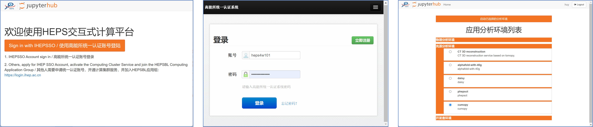
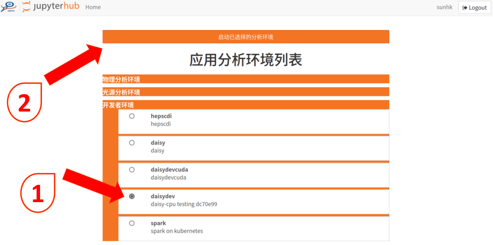

# Download and Installation

本页面描述了Daisy软件框架以及基于Daisy软件框架开发的科学应用软件的下载、安装和使用的方法。

## 一、Daisy

&nbsp;

### Daisy framework

目前，`Daisy` 暂时仅提供源码编译安装的方式，面向 `Linux` 平台。

`Daisy` 源码托管于高能所**git**平台，[code.ihep.ac.cn](https://code.ihep.ac.cn)，项目地址是 [Daisy Project](https://code.ihep.ac.cn/hepscc/Daisy)。

编译安装过程如下：

1. 从仓库复制源代码
   ```bash
   git clone https://code.ihep.ac.cn/hepscc/Daisy.git
   ```
   或直接下载压缩包，
   ```bash
   wget https://code.ihep.ac.cn/hepscc/Daisy/-/archive/main/Daisy-main.tar.gz
   ```

2. 软件依赖
   1. `C++`编译器，建议**gcc**或**clang**。以**gcc**为例，至少**11.2**版本以上；
      - 可以使用CvmFS上已安装版本 `/cvmfs/heps.ihep.ac.cn/software/gcc-11.2.1` ；
   2. `Python`，建议版本**3.11**，至少**3.8**；推荐使用`conda`安装；
   3. `boost`，这是一个独立的C++软件库，需要独立安装编译，建议查看[官方文档](https://www.boost.org/doc/libs/1_84_0/more/getting_started/unix-variants.html)安装，版本**1.84**及以上。

      编译示例如下：假设 Python 3.11 安装在/opt/conda下，boost拟安装在/usr/local下
      1. source gcc和启用Python环境
      2. 下载boost源码
      ```bash
      wget https://sourceforge.net/projects/boost/files/boost/1.84.0/boost_1_84_0.tar.bz2/download -O /opt/boost_1_84_0.tar.bz2
      tar -xf boost_1_84_0.tar.bz2 && cd /opt/boost_1_84_0
      ```
      3. 编译和安装
      ```bash
      ./bootstrap.sh --prefix=/usr/local/boost --with-python=/opt/conda/bin/python3.11
      ./b2
      ./b2 install variant=release debug-symbols=off \
           cflags="${CPPFLAGS} ${CFLAGS} -fPIC -O3 -ffat-lto-objects" \
           cxxflags="${CPPFLAGS} ${CXXFLAGS} -fPIC -O3 -ffat-lto-objects" \
           --layout=system --with-python include='/opt/conda/include/python3.11'
      ```

3. 进入代码所在根目录（压缩包请先解压缩），执行：
   ```bash
   source ./setup.sh
   ```

`Daisy` 将自动完成编译、安装和设置好相应的环境变量，之后每次使用 `Daisy`，都可以执行此脚本；并且脚本经过优化，不会发生重复编译。

更新 `Daisy` 项目时，请保存好自己的工作内容，重新执行上述两步过程即可。

&nbsp;

## 二、 Scientific application

&nbsp;

### 1.谱学匹配程序

点击下载： [软件包](https://docs.ihep.ac.cn/link/AA9C3A30188A4945F9BAE364E8541AA95C)

本软件无需安装，下载之后解压即可直接使用。

本软件用户使用文档请访问 [](../tutorial/XASmatch.md)。


### 2.PCA&LCF 程序

点击下载： [软件包](https://docs.ihep.ac.cn/link/AAF9A02D2FDEF64AED9BB07E00D1414ED4)

本软件无需安装，下载之后解压即可直接使用。

本软件用户使用文档请访问 [](../tutorial/XASpcalcf.md)。


### 3.HEPSCT

本软件为 `web` 应用，请访问交互式计算平台，在浏览器地址栏输入 https://hepscompute.ihep.ac.cn ， 点击 `Sign in with IHEPSSO` 按钮，使用高能所统一认证账号登录。登录之后进入服务选择页面，选择 `cumopy` 项，点击页面最上方 `启动已选择的分析环境` 按钮，进入 `Jupyterlab` 界面。在 `Jupyterlab` 界面中的`IHEP Application` 栏目中点击 `HEPSCT` 图标即可进入 HEPSCT 界面。

本应用用户使用文档请访问 [](../tutorial/hepsct.md)




### 4.Pair Distribution Functions (PDF) pipeline

本应用为 `web` 网页，请访问交互式计算平台，在浏览器地址栏输入 https://hepscompute.ihep.ac.cn ， 点击 `Sign in with IHEPSSO` 按钮，使用高能所统一认证账号登录。登录之后进入服务选择页面，选择 `daisydev` 项，点击页面最上方 `启动已选择的分析环境` 按钮，进入 `Jupyterlab` 界面。在 `Jupyterlab` 界面中的`App` 栏目中点击 `PDF` 图标即可进入 PDF 界面。

本应用用户使用文档请访问 [](../tutorial/PDF.md)



&nbsp;


### 5.HXMT web 数据分析平台

本软件为 `web` 应用，请访问交互式计算平台，在浏览器地址栏输入 https://sdccompute.ihep.ac.cn/ ，进入登录界面，点击 `Sign in with IHEPSSO` 进入高能所统一认证系统界面。在统一认证系统界面中进行用户身份认证。用户登录之后即可进入服务选取界面。登录之后进入服务选择页面，选择 `HXMT data analysis` 项，点击页面最上方 `启动已选择的分析环境` 按钮，进入 `Jupyterlab` 界面。在 `Jupyterlab` 界面中的`IHEP Application` 栏目中点击 `HXMT` 图标即可进入 HXMT 数据分析界面。

本应用用户使用文档请访问 [](../tutorial/astronomy/hxmt.md)。


&nbsp;


&nbsp;


&nbsp;
&nbsp;

欢迎大家提**issues**和贡献**commits**！
