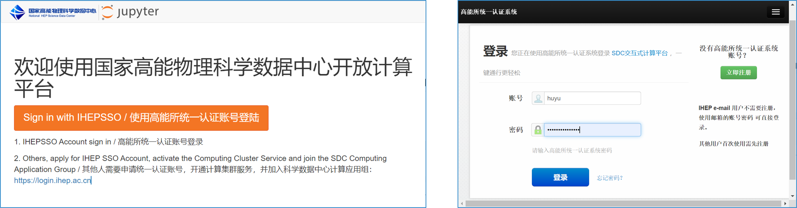
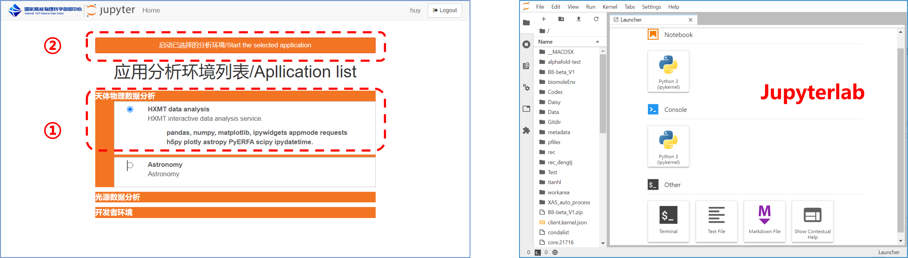
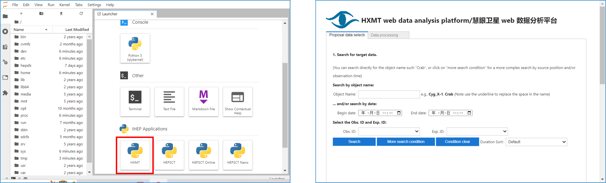
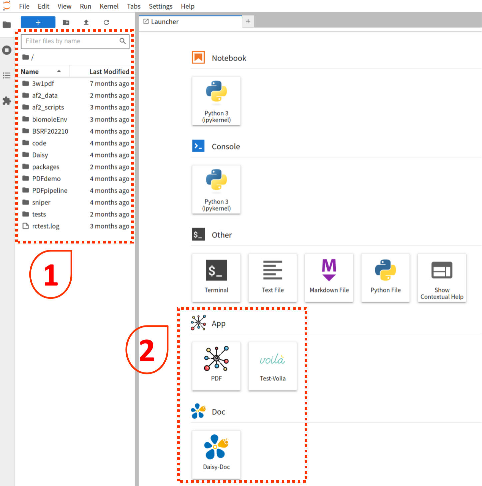

# Download and Installation

## Daisy 

### Daisy framework

目前，`Daisy` 暂时仅提供源码编译安装的方式，面向 `Linux` 平台。

`Daisy` 源码托管于高能所**git**平台，[code.ihep.ac.cn](https://code.ihep.ac.cn)，项目地址是 [Daisy Project](https://code.ihep.ac.cn/hepscc/Daisy)。

编译安装过程如下：

1. 从仓库复制源代码
   ```bash
   git clone https://code.ihep.ac.cn/hepscc/Daisy.git
   ```
   或直接下载压缩包，
   ```bash
   wget https://code.ihep.ac.cn/hepscc/Daisy/-/archive/main/Daisy-main.tar.gz
   ```

2. 进入代码所在根目录（压缩包请先解压缩），执行：
   ```bash
   . ./setup.sh
   ```

`Daisy` 将自动完成编译、安装和设置好相应的环境变量，之后每次使用 `Daisy`，都可以执行此脚本；并且脚本经过优化，不会发生重复编译。

更新 `Daisy` 项目时，请保存好自己的工作内容，重新执行上述两步过程即可。

## Scientific application


#### 谱学匹配程序

点击下载： [软件包](https://docs.ihep.ac.cn/link/AA9C3A30188A4945F9BAE364E8541AA95C)

本软件无需安装，下载之后解压即可直接使用。

本软件用户使用文档请访问 [](../tutorial/XASmatch.md)。


#### PCA&LCF 程序

点击下载： [软件包](https://docs.ihep.ac.cn/link/AAF9A02D2FDEF64AED9BB07E00D1414ED4)

本软件无需安装，下载之后解压即可直接使用。

本软件用户使用文档请访问 [](../tutorial/XASpcalcf.md)。


#### HXMT web 数据分析平台

本软件为 `web` 应用，请访问交互式计算平台，在浏览器地址栏输入 https://sdccompute.ihep.ac.cn/ ，进入登录界面，点击 `Sign in with IHEPSSO` 进入高能所统一认证系统界面。在统一认证系统界面中进行用户身份认证。用户登录之后即可进入服务选取界面。登录之后进入服务选择页面，选择 `HXMT data analysis` 项，点击页面最上方 `启动已选择的分析环境` 按钮，进入 `Jupyterlab` 界面。在 `Jupyterlab` 界面中的`IHEP Application` 栏目中点击 `HXMT` 图标即可进入 HXMT 数据分析界面。

本应用用户使用文档请访问 [](../tutorial/astronomy/hxmt.md)。








#### HEPSCT 

本软件为 `web` 应用，请访问交互式计算平台，在浏览器地址栏输入 https://hepscompute.ihep.ac.cn ， 点击 `Sign in with IHEPSSO` 按钮，使用高能所统一认证账号登录。登录之后进入服务选择页面，选择 `cumopy` 项，点击页面最上方 `启动已选择的分析环境` 按钮，进入 `Jupyterlab` 界面。在 `Jupyterlab` 界面中的`IHEP Application` 栏目中点击 `HEPSCT` 图标即可进入 HEPSCT 界面。

本应用用户使用文档请访问 [](../tutorial/hepsct.md)


#### Pair Distribution Functions (PDF) pipeline

本应用为 `web` 网页，请访问交互式计算平台，在浏览器地址栏输入 https://hepscompute.ihep.ac.cn ， 点击 `Sign in with IHEPSSO` 按钮，使用高能所统一认证账号登录。登录之后进入服务选择页面，选择 `daisydev` 项，点击页面最上方 `启动已选择的分析环境` 按钮，进入 `Jupyterlab` 界面。在 `Jupyterlab` 界面中的`App` 栏目中点击 `PDF` 图标即可进入 PDF 界面。

本应用用户使用文档请访问 [](../tutorial/PDF.md)





欢迎大家提**issues**和贡献**commits**！
