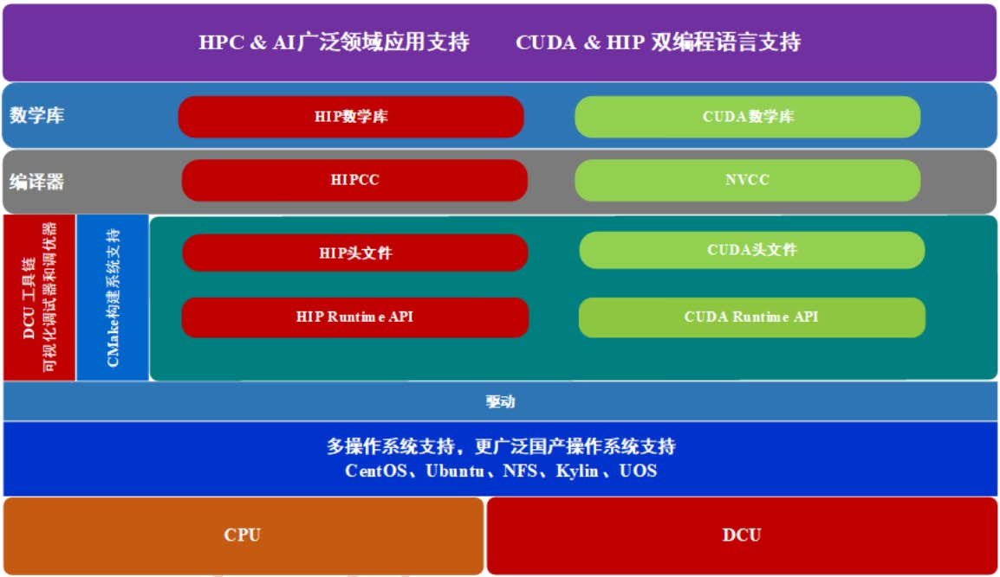
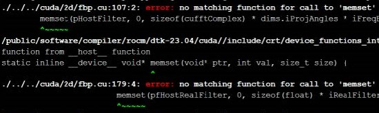
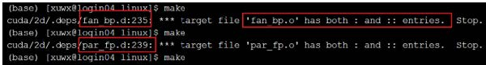
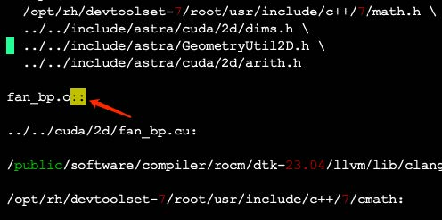
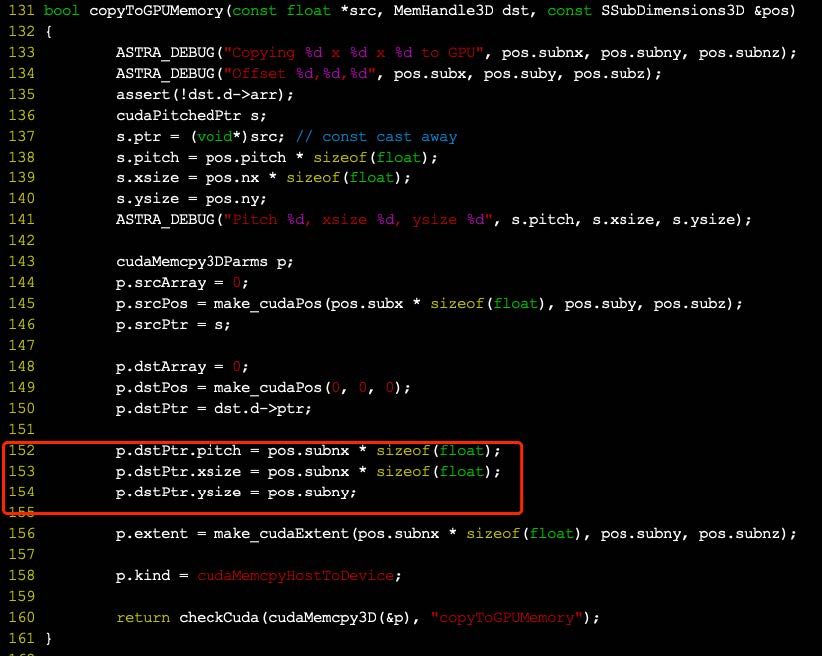

# ROCm 生态适配

## 1 基础简介
DTK（DCU Toolkit）是 DCU 硬件平台开发工具包。借助 DTK 开发人员可以在 DCU 上
开发、优化和部署应用。DTK 同时提供 HIP 和 CUDA 两种编程模型支持，可以快速的将
CUDA 和 ROCm 生态中的已有加速器应用部署在 DCU 上。目前，最新 DTK 已经支持多种
计算框架，包括基础数学算子、科学计算、深度学习等众多领域。

### 1.1 DTK CUDA 使用方法

如上文所述，DTK 支持 CUDA 生态。以 dtk 23.04 为例，其兼容的 CUDA 版本为 10.2.86。
利用这种特性，开发人员可以在不修改源码以及 CMakeLists.txt 的情况下，直接将 CUDA 源
码编译为 DTK 平台的可执行程序。提升了系统兼容性的同时，也为程序的移植工作提供极
大的便利（您可以理解为这是一层封装，本质上调用的是 HIP 编程模型）。

使用前需要配置相应环境变量。DTK 的 cuda 目录中提供了设置环境变量的脚本 env.sh，
设置方法如下：

1） 首先加载 DTK 目录下的 env.sh，用于设置 DTK 环境变量。

source env.sh

2） 接着加载 DTK 中 cuda 目录下的 env.sh，用于设置 CUDA 环境变量。

source $ROCM_PATH/cuda/env.sh

加载上述环境后，可以直接在 DCU 上构建安装支持 CUDA 加速的应用（使用 CUDA
构建的方法）。当然，CUDA 的部分功能目前 DTK 还不支持，需要进行修改。

### 1.2 接口兼容

DTK 提供的 CUDA API 分为以下三类：

1） 支持的 API：接口，行为和输出与原版 CUDA 完全一致。

2） 未严格转换的 API：这一类 API 的行为和 CUDA 原版不完全一致，但不影响系统的正常执行。一般情况下不会影响程序的正确性。在默认情况下，编译期间会提示：

warning:This API is not support currently. This may result in inaccurate results.

用户通过将环境变量 CUDA_STRICT 设为 1 来禁用未严格转换的 API，这种情况
下，未严格转换的 API 会报错处理，终止编译。

3） 不支持的 API：这部分 API 目前 DTK 还不支持，建议使用相关支持的 API 进行替换。

### 1.3 构建系统兼容
DTK CUDA 目前已支持 CMake 的 FindCUDA，enable_language(CUDA)语言特性，可以
在不修改构建系统的情况下，直接对项目进行构建。

find_package(CUDA)特性对 CMake 3.16 至 CMake 3.24 之间的版本均支持。

enable_language(CUDA)特性在 CMake 3.16.2 到 CMake 3.24.2 范围的版本做了测试，其
中通过测试的版本为 3.16.2，3.18.2，3.19.2，3.20.2，3.21.2，3.22.2，3.23.2，3.24.2。其他更
多版本未做可用性测试。后续将会适配更多的 CMake 版本。

建议使用 CMake 3.16.2 版本，该版本已经过较全面的测试。

### 1.4 程序编译
编译期间，不支持的参数会通过 warning 显示出来。

目前所有的 CUDA GPU arch 均会转换为默认的架构名 gfx906，如果用户未设置 arch，
或者 arch 中含有非 gfx906 的情型，程序将会给出 warning 以进行警示。

### 1.5 核函数兼容

DTK CUDA 支持 CUDA 的核函数调用语法：

kernel<<<gridSize, blockSize, shardMemorySize, Stream>>>(Args)。

## 2 适配流程

### 2.1 程序构建

* 基于 Makefile

对于以 Makefile 方式构建的应用来说，相关的 cuda 路径已经固化在 Makefile 中，因此
需要用户手动进行替换。用户需要手动替换 cuda path，以及以 cuda path 为基础的 nvcc 路径
和 lib 路径。

* 基于 CMake

DTK CUDA 支持 find_package(CUDA)和 enable_language(CUDA)的 CMake 特性。可以
在不修改任何构建系统的基础上，引导 cmake 将相关目录指向 DTK cuda 的文件夹。使用方
法与原生 CUDA 一致。因为 CMake 版本众多，且在不断迭代更新中，不能保证每一个版本都能适用，因此建议在已验证过的版本中进行选择，优先建议使用 3.1.6.2 版本。

### 2.2 程序编译

在程序编译过程中如果出现错误，建议先使用单线程输出详细信息，以输出真正错误处
的构建指令，方便问题分析。指令如下:

make VERBOSE=1

###2.3 程序运行

DTK 为了程序最高的效率，默认线程的最大值为 256，在程序运行中如果出现以下提
示，则需要调整最大值的大小。

Launch params (1024, 1, 1) are larger than launch bounds (256) for kernel

可以在编译命令中添加“--gpu-max-threads-per-block=1024”后重新编译，或者在核函数头
部添加“__launch_bounds__(1024)”。

### 2.4 结果检查

如果程序运行结果不正确，此时需要检查程序中 warp size 的设置。默认原生 CUDA 的
warp size 为 32，DTK 软件栈适用的 warp size 为 64。用户需要确保项目中所有的 warp size
修改为 64，以保证程序的正确性。

## 3 适配工作中的问题举例

### 3.1 tomocupy

1）g++编译 cu 代码无法识别 clang 内置的_Float16，需改用 nvcc 进行编译；
2）hipfft 暂不支持半精度计算，关闭 half 精度选项，所有计算皆基于单精度；
3）对应的.cu 文件中加入 cstring 头文件解决缺少 memset 函数问题。
4）cufftXtMakePlanMany 和 cufftXtExec 暂未实现，分别用 cufftMakePlanMany
、cufftExecR2C 进行改写替换。

### 3.2 astra

构建中会出现两个错误：

第一种错误如图所示，解决方法是在对应的.cu 文件中加入 cstring 头文件。

第二种错误是 Makefile 对于 target 构建规则的单、双冒号冲突，具体表现如下图所示。

目 前 解决方 法 是 将预处 理 后 生成的 中 间 文 件 （依赖文 件 ） 进 行 修 改 ， 进入 astra-toolbox/build/linux/cuda/2d/.deps/和 astra-toolbox/build/linux/cuda/3d/.deps/，将目录下的.d 文件
中的“::”修改为“:”。

测试中发现 2d 和 3d 计算结果有误。

排查后发现 2d 中的错误是由于数据拷贝过程（Host to Device）存在问题，cudaMemcpy2D
中输入输出的 size 不同，导致设备端上存在大量无效数据。将 size 统一为 input 的 size 即可。

3d 计算的问题与 2d 相似，但由于 cudaMemcpy3D 函数比较特殊，需要添加如图红框中所示代码：

### 3.3 ufo

ufo 适配中没有出现特殊问题，可以按照官方构建手册中的步骤进行，只需及时将构建
完成的应用 lib 加入环境变量中即可。
