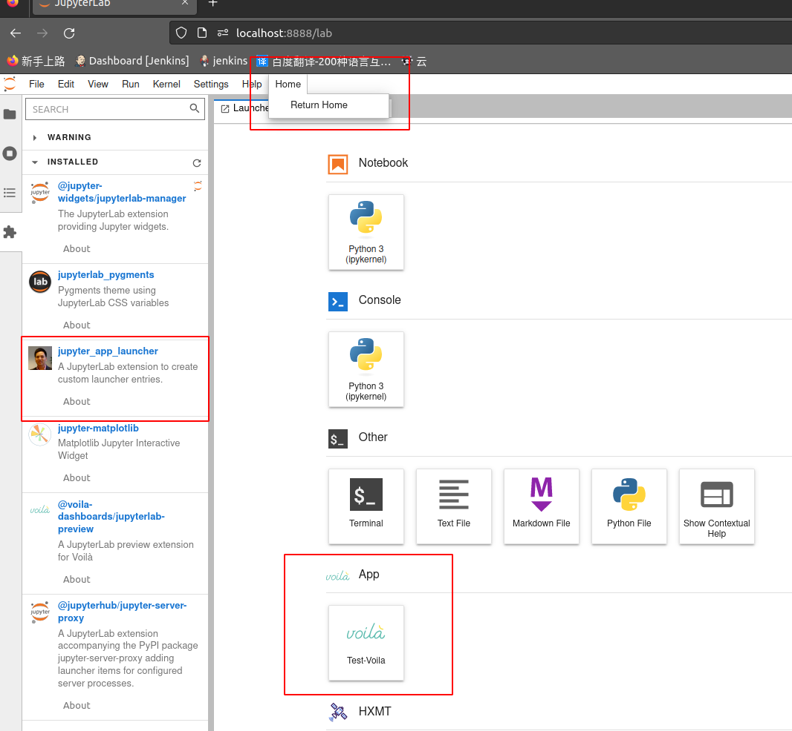

# jupyter 二次开发

## 1. Jupyterlab插件安装配置及其环境变量配置

本项目提供了插件jupyter_app_launcher的安装包：

* jupyter_app_launcher-0.1.6-py3-none-any.whl 

安装该插件的命令为：

* pip install jupyter_app_launcher-0.1.6-py3-none-any.whl 

该插件在菜单栏提供了 Home菜单，可以点击菜单"Return Home"返回jupyterhub的首页；

当Jupyterlab插件jupyter_app_launcher已经安装在jupyterlab开发环境之中，用户只需修改对应的配置文件，即可在jupyterlab的launcher页面添加应用图标。

插件jupyter_app_launcher的配置文件位置为：

* /opt/jupyter_app_launcher/config.yaml  

指向该地址的环境变量为 **JUPYTER_APP_LAUNCHER_PATH**，用户使用以下命令使该环境变量生效：

* export JUPYTER_APP_LAUNCHER_PATH="/opt/jupyter_app_launcher" 

关于配置文件的书写规则如下，原文可参考https://jupyter-app-launcher.readthedocs.io/en/latest/usage.html.

- title: Dashboard example \
  description: Example of opening a notebook in dashboard mode without Voila \
  source: ../../samples/sample.ipynb \
  cwd: ../../samples \
  type: notebook-grid 

- title: Notebook example \
  description: Example of opening a notebook in dashboard mode without Voila \
  source: ../../samples/sample.ipynb \
  cwd: ../../samples \
  type: notebook \
  catalog: Another catalog 

- title: Voila example \
  description: Example of opening a notebook in dashboard mode with Voila \
  source: ../../samples/sample.ipynb \
  cwd: ../../samples \
  type: notebook-voila \
  args: \
      theme: dark \
  catalog: Another catalog \

- title: WebApp example \
  description: Example of opening a notebook in browser with Voila \
  source: ../../samples/sample.ipynb \
  cwd: ../../samples \
  type: WebApp-voila \
  args: \
      theme: dark \
  catalog: Another catalog 
 
- title: URL example \
  description: Example of opening a URL in a tab \
  source: https://jupyterlab.readthedocs.io/en/stable/ \
  type: url  \
  catalog: Another catalog \
  args: \
      sandbox: [ 'allow-same-origin', 'allow-scripts', 'allow-downloads', 'allow-modals', 'allow-popups'] 

- title: Streamlit example \
  description: Example of opening a streamlit app \
  source: http://localhost:$PORT/ \
  cwd: ./  \
  type: local-server \
  args: \

    - streamlit
    - run
    - st_app.py
    - --server.headless=true
    - --server.port=$PORT
      catalog: Another catalog

  配置文件书写规则如下： \
    title : lancher页面图标的名称；\
    description ：对该应用的说明； \
    source ：本机资源文件，例如Notebook, voila的源文件，Url， local server的链接地址； \
    cwd : 弃用； \
    type : 应用的类型，只能是以下类型之一：  \
  		   - 'notebook'，\
  		   - 'notebook-grid'，\
  		   - 'notebook-voila'，\
  		   - 'markdown'，\
  		   - 'local-server'，\
  		   - 'url'， \
  		   - 'webapp'; \
   args : 参数；\
   catalog ：应用的归类，同一类应用在launcher页面放在同一行；

如果修改了配置文件，则需要重启jupyter lab服务，目前无法做到实时更改实时显示。
	 
