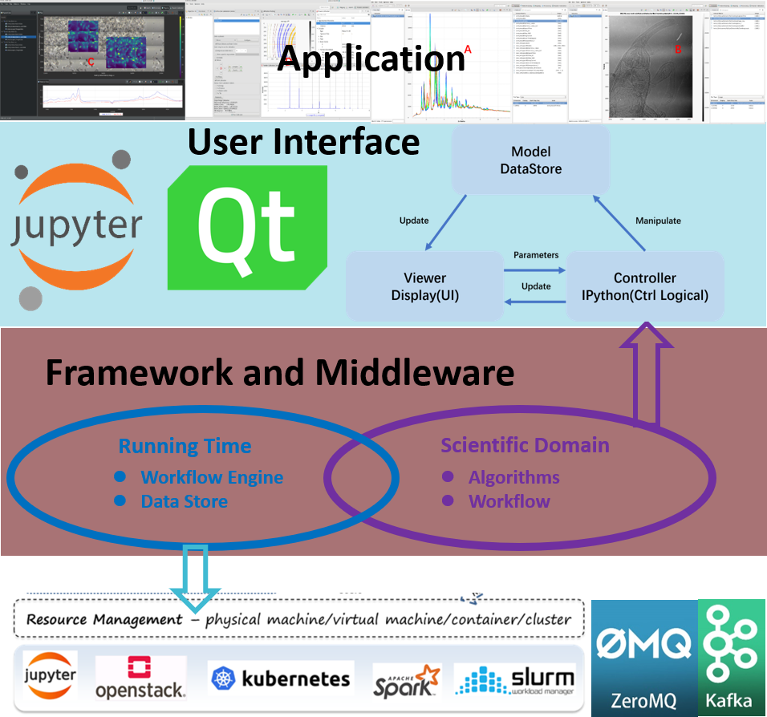

# 软件架构

&emsp;&emsp;如下图所示，在我们的系统设计中，最小的单元称为算法，一个领域模型对应一个或多个算法，这些算法的实现与具体的计算软硬件环境有关，同一算法可以由多个实体实现，可以相互替代；领域模型之间的关系，既领域架构，由工作流定义，工作流通过调用一系列算法，完成特定的计算处理任务。为了解除工作流与计算环境之间的耦合，增加工作流的可移植性，工作流只定义领域架构，既算法之间的调用关系，算法实体的初始化和管理由工作流引擎实现，工作流引擎根据计算环境提供的计算资源，在运行时判断算法的具体执行实体，同时管理算法模块的并行分布式执行。此外，算法之间数据对象的创建和传递由数据仓库负责管理，使业务代码完全不用考虑数据对象的管理问题。

 &emsp;&emsp;数据处理软件系统从低向上分为四层，分别是基础设施层，领域层，用户界面层和应用层，其中：

   1. 领域层以算法和工作流为核心；

   2. 领域层通过工作流引擎和数据仓库，调用基础设施层提供的软硬件计算资源，包括第三方软件库、容器、计算资源、网络、存储等，实现数据 IO、内存管理、模块交互等软件公共功能模块，以及分布式中间件提供的分布式任务调度、数据传输和消息传递服务；

   3. 领域层通过 API支持丰富的用户界面层，如图形化用户接口（ GUI）、脚本支持（ CLI）和 Web数据分析服务（ Web API）

   4. 应用层调用领域层和用户界面层提供数据处理服务和数据可视化服务，通过对用户模块的组装和配置，应用层可构建专注于实验数据处理的专业软件或工具。

&emsp;&emsp;该架构向用户和领域专家隐藏软件系统内部细节，使其专注于数据处理的业务过程，并通过友好和可视化的接口降低用户使用的难度。

