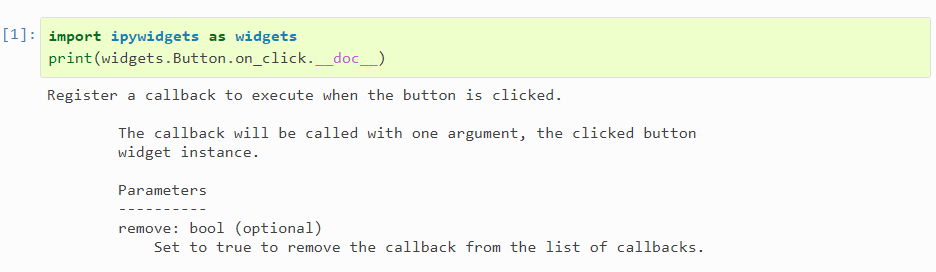
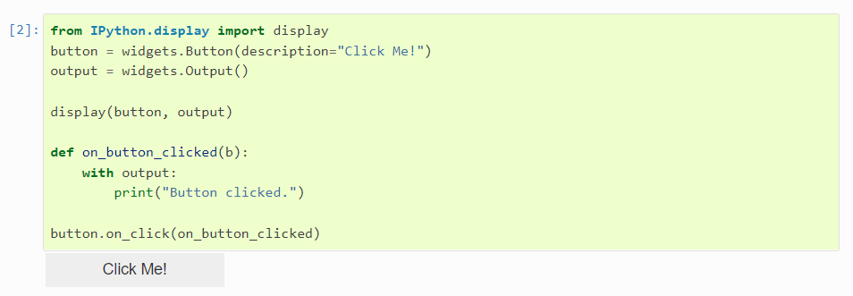
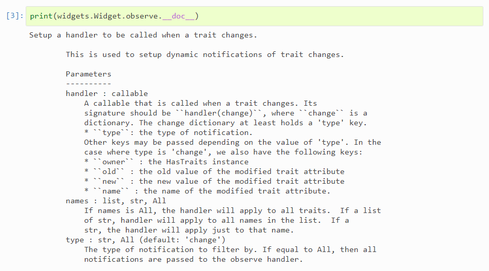
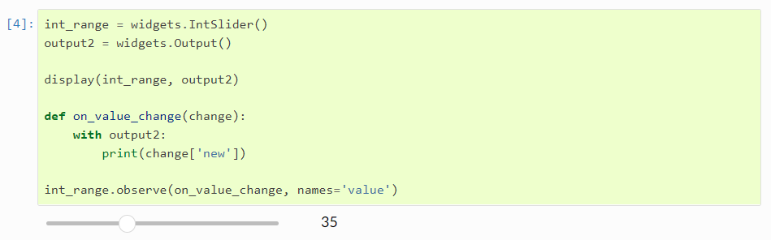
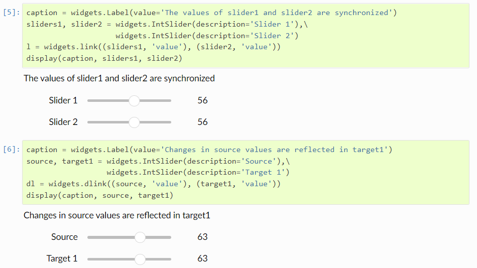
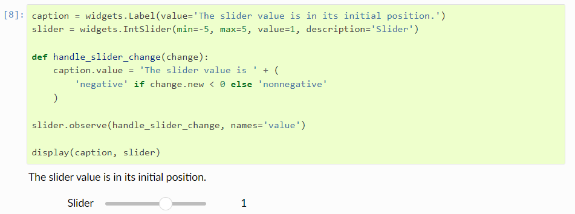
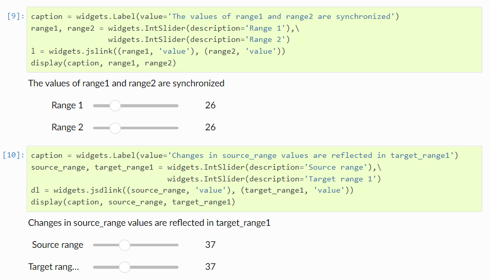
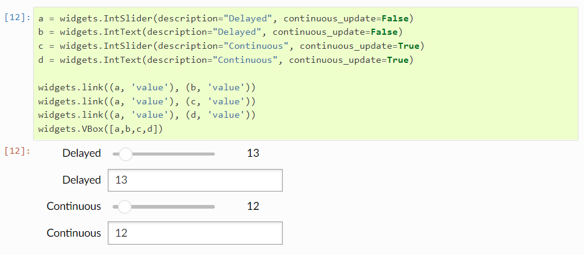

# widgets 事件

## 特殊事件
Button不用于表示数据类型，而用于处理鼠标单击。Button的 on_click 方法可以用于注册当按钮被点击时被调用的函数。on_click的详细情况如下所示：



**示例**

由于按钮单击是无状态的，因此使用自定义消息将按钮单击从前端传输到后端。通过使用on_click方法，下面显示了一个按钮，它在被单击时打印一条消息。要捕获打印(或任何其他类型的输出)并确保它被显示，需要将其发送到output小部件(或将想要显示的信息放入HTML小部件)。




## Traitlet 事件

widgets 的属性是IPython 的 Traitlets，Traitlets是事件性的。widget的observe方法可以用来注册一个callback，以处理变化。observe的详细情况如下所示：



**Signatures**
如doc所述，注册的callback必须是handler(change)的形式，其中change是一个包含change信息的字典。
以下示例展示了如何利用这个方法在IntSlider改变时将其值打印到output。




## 连接 widgets
通常，用户可能只想将小部件属性链接在一起。可以用比使用显式traitlets事件更简单的方式实现属性的同步。

**Linking traitlets attributes in the kernel**
第一种方法是使用来自traitlets模块的link和dlink函数(为了方便起见，这两个函数由ipywidgets模块重新导出)。这只在我们与活跃内核进行交互时有效。



traitlets.link 和 traitlets.dlink 函数各自返回一个Link和DLink 对象。Link可以通过unlink方法断开。


**Registering callbacks to trait changes in the kernel**

在Python部分，widgets 的属性都是traitlets， 所以用户可以将handlers注册到当模型从前端获得更新时的change事件。传递给observe的handler程序将使用一个change参数调用。change对象持有至少一个type键值和一个name 键值，分别对应于通知的类型和触发通知的属性的名称。根据type的值，可以传递其他键。在type为change的情况下，还有以下键:

- owner: HasTraits实例
- old:修改trait属性的旧值
- new:修改trait属性的新值
- name:修改trait属性的名称。



**Linking widgets attributes from the client side **

在同步traitlet属性时，由于到服务器端的往返所造成的延迟，您可能会遇到延迟。还可以使用链接小部件在浏览器中以单向或双向的方式直接链接小部件属性。

在没有内核的html页面中嵌入小部件时，Javascript链接会持续存在。



widgets.jslink 函数返回一个 Link  widget，该link可以通过调用 unlink 方法解开。

**The difference between linking in the kernel and linking in the client**

在内核中链接意味着通过python进行链接。如果两个sliders在内核中被链接，当一个slider被更改时，浏览器向内核(本例中是python)发送一条消息更新更改的slider，然后内核中的link小部件将更改传播给内核中的另一个slider对象，然后另一个slider的内核对象向浏览器发送一条消息来更新浏览器中另一个slider的视图。如果内核没有运行(就像在静态网页中那样)，那么控件将不会被链接。

使用jslink(即，在浏览器端)进行链接意味着用Javascript构建链接。当一个slider发生变化时，运行在浏览器中的Javascript会改变浏览器中另一个slider的值，而根本不需要与内核通信。如果滑块附加到内核对象，每个滑块将独立地更新它们的内核端对象。

要查看两者之间的区别，请转到ipywidgets文档中的此页面的[静态版本](http://ipywidgets.readthedocs.io/en/latest/examples/Widget%20Events.html)，并尝试底部附近的slider。在内核中使用link和dlink链接的代码不再被链接，但是在浏览器中使用jslink和jsdlink链接的代码仍然被链接。


## Continuous updates

一些小部件通过其continuous_update属性提供了连续更新值或仅在用户提交值时更新值的选择(例如，按Enter或导航离开控件)。在下一个例子中，我们看到延迟控件只在用户完成拖动滑块或提交文本框后才传输它们的值。当值被更改时，Continuous控件继续传输它们的值。



Sliders，Text 和 Textarea 控件默认为continuous_update=True。IntText 和其他输入整数或浮点数的文本框默认为continuous_update=False(因为通常你会想要在提交值之前输入一个完整的数字，通过按回车键或导航出框)。


##  消除抖动（Debouncing）
​        当特征变化触发执行大量计算的回调时，您可能不希望在值更新时进行计算。例如，如果trait是由一个slider驱动的，它的continuous_update设置为True，那么用户将快速连续地触发一系列计算。
​        Debouncing 可以解决这个问题，它延迟回调的执行，直到值在一段时间内没有变化，然后用最新的值调用回调。其效果是，只有当特征暂停更改一段时间后才调用回调。
​        Debouncing 可以使用异步循环或线程来实现。我们将在下面展示一个异步解决方案，它更适合于ipywidgets。如果您想要使用线程来执行退出，可以将Timer类替换为from threading import Timer。

```python
import asyncio

class Timer:
    def __init__(self, timeout, callback):
        self._timeout = timeout
        self._callback = callback

    async def _job(self):
        await asyncio.sleep(self._timeout)
        self._callback()

    def start(self):
        self._task = asyncio.ensure_future(self._job())

    def cancel(self):
        self._task.cancel()

def debounce(wait):
    """ Decorator that will postpone a function's
        execution until after `wait` seconds
        have elapsed since the last time it was invoked. """
    def decorator(fn):
        timer = None
        def debounced(*args, **kwargs):
            nonlocal timer
            def call_it():
                fn(*args, **kwargs)
            if timer is not None:
                timer.cancel()
            timer = Timer(wait, call_it)
            timer.start()
        return debounced
    return decorator
```

下面是如何使用debounce函数作为装饰器。尝试改变滑块的值。文本框只有在滑块暂停约0.2秒后才会更新。

```python
slider = widgets.IntSlider()
text = widgets.IntText()

@debounce(0.2)
def value_changed(change):
    text.value = change.new
slider.observe(value_changed, 'value')

widgets.VBox([slider, text])
```

##  Throttling

​       Throttling 是另一种可以用来限制回调的技术。如果从最后一次(尝试)调用函数到现在还有一段时间，那么 debouncing 将忽略对该函数的调用，而throttling只会限制调用的速率。这可以确保定期调用函数。

​       下面展示了一个同步解决方案。同样，如果您想使用线程而不是异步编程，也可以使用from threading import Timer来替换Timer类。

```python
import asyncio
from time import time

def throttle(wait):
    """ Decorator that prevents a function from being called
        more than once every wait period. """
    def decorator(fn):
        time_of_last_call = 0
        scheduled, timer = False, None
        new_args, new_kwargs = None, None
        def throttled(*args, **kwargs):
            nonlocal new_args, new_kwargs, time_of_last_call, scheduled, timer
            def call_it():
                nonlocal new_args, new_kwargs, time_of_last_call, scheduled, timer
                time_of_last_call = time()
                fn(*new_args, **new_kwargs)
                scheduled = False
            time_since_last_call = time() - time_of_last_call
            new_args, new_kwargs = args, kwargs
            if not scheduled:
                scheduled = True
                new_wait = max(0, wait - time_since_last_call)
                timer = Timer(new_wait, call_it)
                timer.start()
        return throttled
    return decorator
```

要查看它与debouncer的行为有何不同，这里是相同的滑块示例，其throttled值显示在文本框中。注意它的交互性有多强，同时仍然限制了回调率。

```python
slider = widgets.IntSlider()
text = widgets.IntText()

@throttle(0.2)
def value_changed(change):
    text.value = change.new
slider.observe(value_changed, 'value')

widgets.VBox([slider, text])
