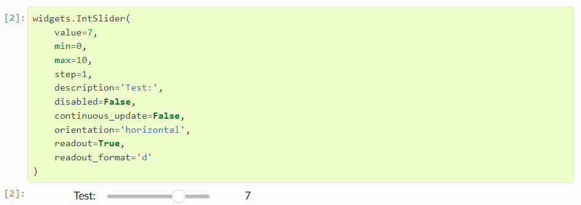
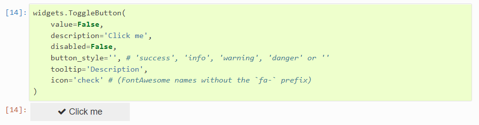
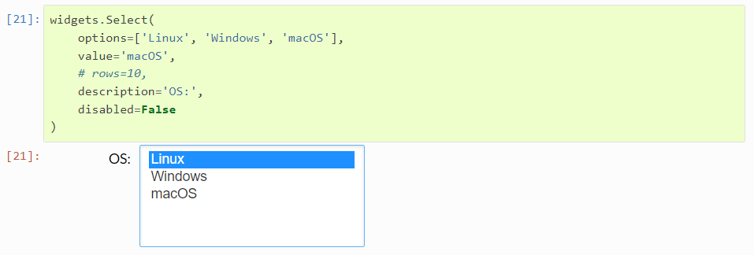
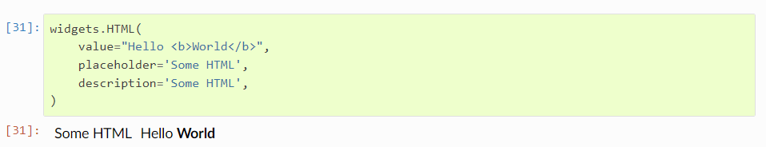

# 常用的 widgets 

widgets 主要包含 数值型，布尔型，选项型，字符串型，以及其他特殊类型等几大类。

**1. 数值型 widgets**

数值型 widgets 是为显示数值而设计的，用于显示整数和浮点数(包括有界和无界)。整型 widgets 和 浮点型 widgets 共用相似的命名规则。将 widgets 名字的 Int 替换为 Float 即可找到相应的 widgets。此处以IntSlider 为例，其他数值型 widgets 类似。

**IntSlider**

- 滑块以指定的初始 value 显示。下界和上界由min和max定义，其值可根据step参数递增。
- 滑块标签由 description 参数定义。
- 滑块的 orientation 为 ‘horizontal’ (default) 或者 ‘vertical’ 。
- readout 在Slider旁边显示其当前值，可选值为 **True** (default) 或 **False**。readout_format 指定表示Slider 值的格式化函数，默认为 ‘.2f’。

**2. 布尔型 widgets**

boolean widgets 用于显示布尔型值。此处以ToggleButton 为例，其他boolean widgets类似。

**ToggleButton **

- value 指定 ToggleButton的值。
- indent 参数放置一个缩进的widgets，与其他控键保持对齐。选项为True（默认） 或False。

**3. 选项型 widgets**

Selection widgets 可用于显示单个选择列表，多个选项列表。都是从同一个基类继承的。用户可以通过传递一个列表(选项是(标签、值)对，或者只是从调用str派生出来的标签的简单的值)来指定可选选项的枚举。此处以 Select 为例，其他Selection widgets类似。

**Select**

**4. 字符串型 widgets**

String widgets 用于展示字符串值，Text, Textarea, 和 Combobox 接收输入， HTML 和 HTMLMath 将字符串以HTML形式展示。Lable 可用于构造自定义控件标签。此处以 HTML 为例，其他String widgets类似。

**HTML**

此外还有一些常用的widgets，比如Image 用于展示图片，Button用于展示一个按钮，Output用于捕获和展示 stdout、 stderr、以及IPython产生的丰富的output，DatePicker 用于选择日期等等。

更多支持的部件见https://ipywidgets.readthedocs.io/en/latest/examples/Widget%20List.html#。
