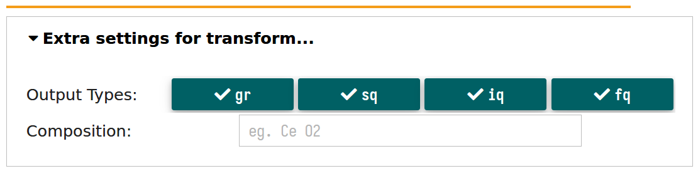

# Pair Distribution Functions (PDF) pipeline

<!-- markdown-toc start - Don't edit this section. Run M-x markdown-toc-refresh-toc -->
**Table of Contents**

- [Pair Distribution Functions (PDF) pipeline](#pair-distribution-functions-pdf-pipeline)
    - [简介](#简介)
        - [版本](#版本)
        - [技术路线](#技术路线)
        - [数据处理流程](#数据处理流程)
    - [界面入口](#界面入口)
        - [网站页面](#网站页面)
        - [Jupyterlab Launcher页面](#jupyterlab-launcher页面)
    - [主界面基本布局](#主界面基本布局)
    - [分界面功能介绍](#分界面功能介绍)
        - [pipeline（进入后的默认tab）](#pipeline进入后的默认tab)
        - [integarte 积分](#integarte-积分)
        - [transform 获取PDF](#transform-获取pdf)
    - [后续开发计划](#后续开发计划)

<!-- markdown-toc end -->

## 简介
此项目是面向先进光源 [HEPS](https://heps.ihep.ac.cn "High Energy Photon Source") 的数据处理软件框架 [`Daisy`](https://code.ihep.ac.cn/hepscc/daisy) 的子项目之一，主要服务于**B1**、**B3**、**B6**等线站，项目主页位于 [Daisy-PDF](https://code.ihep.ac.cn/sunhk/PDFgui.git)。

### 版本
`v1.0`，目前仅具备用于测试的基本功能，可能有 *bug* 存在，欢迎各位的意见、建议和批评指正。

### 技术路线
`Docker+Jupyterhub`，**Client-Server** mode。

### 数据处理流程
主要为积分和获取 *PDF* 两大步骤。具体如下图所示，

## 界面入口

### 网站页面
目前开放了 [hepscompute](https://hepscompute.ihep.ac.cn) 和 [hepscs](https://hepscs.ihep.ac.cn) 两个开发、测试和准生产平台，用户需要：

1. 申请注册高能所 *SSO* 账号
2. 申请集群账号并加入 *HEPSBL* 用户组
3. 所外网络访问还需要高能所提供的 *VPN*

以下均以 [hepscompute](https://hepscompute.ihep.ac.cn) 为例，登录后的界面如下：

按上图中的顺序提示，先选择 *PDF* 所属镜像 `daisydev`，然后点击上方的长按钮，约十秒后便可进入计算环境。

### Jupyterlab Launcher页面

进入计算环境后，整体的界面如下所示，

其中，标记为**1**的红色虚线框中是文件浏览器部分，展示的是用户目录下的文件内容，因此不同用户，此处的内容也是不同的；标记为**2**的红色虚线框中的是主界面 *Launcher* 中需要我们关注的部分，后续随着子项目的开发，此处会不断调整和丰富。

1. 点击第一个含有 *PDF* 字样的图标即可进入到 [Daisy-PDF](https://code.ihep.ac.cn/sunhk/PDFgui.git) 的主界面
2. 点击最下方 *Daisy Doc* 则进入 [Daisy](https://code.ihep.ac.cn/hepscc/daisy) 的文档，里面含有本文档的最新版内容

## 主界面基本布局

点击 *PDF* 图标进入到 [Daisy-PDF](https://code.ihep.ac.cn/sunhk/PDFgui.git) 的主界面（根据网络情况，大约等待几秒钟）后，主界面如图，

从上到下共三部分：

1. 子项目图标和标题
2. 含有三个 **tab** 页的主体
3. 版权信息

## 分界面功能介绍

### pipeline（进入后的默认tab）

本分页面是 [Daisy-PDF](https://code.ihep.ac.cn/sunhk/PDFgui.git) 的主体，如名所示，是配置和运行整个数据处理流程的流水线。

1. 最上方的部分，如下图所示，是选择**衍射数据所在路径/位置**和**数据处理结果输出路径/位置**的地方；并且为了方便用户的选择，下方提供了用于数据图像预览和过滤的功能，经过过滤后的文件将被用于后续的处理。

本项目所有的*文件（夹）*选择界面遵循同样的使用逻辑，单击后如下所示，文件夹单击进入，点击上方第二项\<Parent Folder\>则是退回到上级文件夹；

如果想选择当前的目录，点击第一项\<Choose Folder\>，展开的下拉框会自动收回，并且页面上会出现一个绿色的原点表示已选择，如下图。

PS: BSRF上3W1线站的PDF数据位于 `/hepsfs/public_database/3w1pdf/` 路径下。

结果输出位置默认是和数据文件相同，但**强烈建议**选择更合适的文件夹。

数据文件的预览和过滤/筛选如下图所示，过滤的功能分为两部分，左侧是最常见的关键词过滤；

右侧则是考虑到线站上往往同一样品会测量非常多组，然后命名以数字顺序结尾，假设只想处理其中的部分文件，则可在这里填上相应的排序数字，连续区间，比如第3号到第11号，只需输入`3-11`；

需要注意的是启用这一功能，需要在左侧填入 `!!` 作为占位符，用以表示序列和关键词的位置关系。

*当用户使用过滤功能后，仅过滤后的文件会用于后续处理*，**这一点请一定注意！**

选择下方相应的文件，即可预览，由于有些数据文件在纯的灰度展示下难以分辨，所以默认开启了渲染。

2. 中间部分，如下图所示，是配置文件选择的地方，包括用于积分的 `poni` 或 `json` 文件和用于获取 *PDF* 的 `cfg` 文件。

这里的文件选择器没有了\<Choose Folder\>一项，文件选好后，点击即可选定。

对于不同的选择器，也做好了按文件的后缀名自动过滤，方便用户选取相应的配置文件，例如选 `cfg` 文件时，选择器只会展示当前文件夹下的以cfg为文件扩展名的文件供用户选择。

3. 下方的第三部分是允许用户对积分或者获取 *PDF* 的配置参数进行额外的设置，优先级高于配置文件。

4. 最下方是运行/停止按钮和结果展示。

点击 `Run` 按钮即可以CPU多核的形式并行进行加速计算，这对于多数据文件的处理是很高效的。

### integarte 积分

积分部分，仅包括衍射数据文件的批量积分功能，详细的使用说明已经包含在 [`pipeline`](#pipeline进入后的默认tab) 一节中。

### transform 获取PDF

获取 *PDF* 部分，仅包括将积分后的文件（.chi）计算得到相应的 *PDF* 文件，目前支持4种输出类型 `[gr, iq, fq, sq]`，详细的使用说明已经包含在 [`pipeline`](#pipeline进入后的默认tab) 一节中。

## 后续开发计划

### 界面层面

1. 衍射数据预览功能加强，包括局部放大、多种渲染器支持等

2. 参数设置更全面且支持生成配置文件

3. (待补充 -->)

### 功能层面

1. masking功能实现

2. mapping plot

3. PDF寻峰

4. (待补充 -->)
