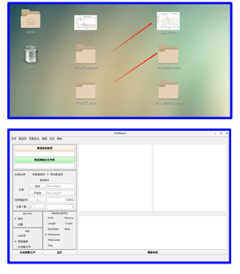
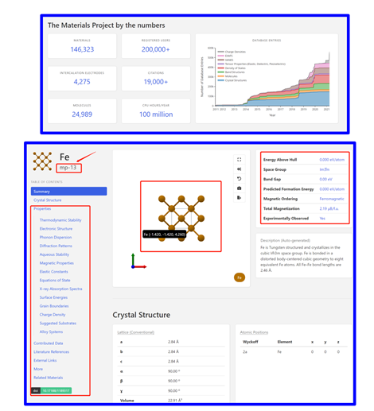
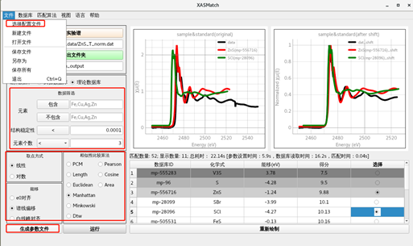

# 谱学匹配程序

## 技术路线

吸收谱谱学匹配程序目前实现的功能为给出数据库中与输入谱线最相似的谱线及数据库中对应信息。其技术路线如下图所示。

## 程序下载

## 程序启动
我们已配置好的同步软件会自动将线站计算机上的数据同步目录的数据自动同步到桌面的“XASMatch_data”文件夹中，如图4上图所示。在进入登陆界面后，我们只需点击桌面上的“XASMatch”图标即可进入谱学匹配程序，界面如下图所示。

## 使用流程
进入该程序界面后，我们只需要点击“选择实验谱”按钮选择待匹配的实验谱，点击桌面上的“XASMatch_data”文件夹选择从线站计算机同步过来的数据，这里我们选取用于测试的ZnS吸收谱数据“ZnS_T_norm.dat”，点击“Open”即可选中该数据，如下图所示。

同样的，我们选取“XAS_Match_output”作为我们结果输出文件夹，该处理结果文件也会同步到线站对应的数据同步目录中。

在选择好实验目录以及输出文件夹后，我们需要选取数据库与样品数据进行比较。我们预计提供两种数据库以供选择，第一种为BSRF线站已知结构的样品实验吸收谱数据，第二种为国际广泛使用的Materials Project理论计算数据库。因为线站的样品实验吸收谱数据库还在建构过程中，因此本期测试暂不提供使用。

Materials Project（https://materialsproject.org/ ）是一个材料基因组数据网站，其提供了超过14万个无机化合物的结构信息以及性质。其存储的数据量和数据类型如上图所示，其中包含了超过10万条的XANES、EXAFS数据供我们进行谱学匹配。在得到最为匹配的结果后，我们不仅可以得到最为匹配结构的化学式，还可以得到其稳定性信息，该结构的空间群及其发表的文章DOI等信息，如下图所示。

在完成数据库来源选择后，我们可以直接点击“运行”按钮进行谱学匹配处理。得到的结果如下图的右图所示（黑色实线为待匹配的实验数据的谱线），我们会给出前11个最为匹配的结果，如下图右下角的表格所示。我们可以选择某几个感兴趣的匹配结构，点击“重新绘制”，即可在右上角的图形显示框中进行重新绘图。
用户除了使用默认的设置外，也可以按照自己对体系的判断进行数据库筛选，目前提供的筛选条件有：1. 包含元素[ ]（如认为体系中必须包含某些元素，（不包含吸收原子）），2. 不包含元素[ ], 3.结构稳定性(采用Energy Above Hull这个指标来判别)[ ]，4.元素个数[ ]（对体系包含的元素种类个数的限制（>, <, =））。此外，对于匹配算法，也可以对默认的取点方式，谱线能移处理方式以及相似性比较算法进行修改。
此外，为了节约用户的参数设置时间，用户只需要在该界面设置完一次匹配参数即可点击“生成参数文件”按钮将用户设置的实验谱路径，文件保存路径，谱学匹配参数等所有设置文件保存到文本文件中，下次进入该程序时只需要点击“选择配置文件”再点击用户保存的文本文件即可将之前选择的参数配置导入程序当中。

## 结果保存
程序的处理结果会保存在我们设置好的结果保存路径（XAS_Match_output）下该处理结果文件也会同步到线站对应的数据同步目录中，用户可自行拷走。

