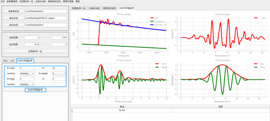

# PCA&LCF程序

## 程序下载和安装

点击下载： [软件包](https://docs.ihep.ac.cn/link/AAE67B274B4ED74B279597B07BD9D3164C)

本程序无需安装，下载之后解压即可直接使用。

## 程序启动
待软件包解压缩之后，进入软件包“PCALCF”文件夹中，如下图左图所示。我们只需点击文件夹中的的“pca&&LCF”图标即可进入PCALCF处理程序，界面如下图所示。

## 扣背底/归一化
进入该程序界面后，我们只需要点击“实验谱目录”按钮选择待匹配的实验谱目录，点击桌面上的“PCALCF_data”文件夹选择从线站计算机同步过来的数据。在线站计算机的同步目录下需要将样品放在一个文件夹中（如“sample”文件夹），将标样放在另外一个文件夹中（如“standard”文件夹），且需要保证这两个文件夹中含且仅含样品数据/标样数据。这里我们选取用于测试的BSRF文件夹下的“sample”文件夹，点击“Open”即可选中该文件夹，如下图所示。

同样的，我们选取“PCALCF_output”作为我们结果输出文件夹，该处理结果文件也会同步到线站对应的数据同步目录中。选取“PCALCF_data/BSRF/standard”文件夹作为标样文件夹。
在读入数据后，我们点击“扣背底/归一化”按钮即可对所有的样品和标样数据进行扣背底/归一化处理，如下图所示。在得到结果后，我们可以点击图10右下角表格所示的选择按钮对样品/标样进行显示选择，点击“重新绘图后”即可进行所选择数据的图形显示。下图右上角的左图即为所选择的数据显示，如果选择的是样品数据，下图右上角的右图会显示所有的样品数据的归一化之后的谱线。同样的，如果选择的是标样数据，下图右上角的右图会显示所有的标样数据的归一化之后的谱线。此外，我们还可以对边前范围和变后范围进行自定义调整。

## PCA处理
在完成扣背底归一化之后，我们进行主成分（PCA）分析。这里，我们需要对PCA训练数据和PCA拟合数据进行选择，但是需要确保训练数据量大于2。在这里我们将标样（组分数据）数据作为训练数据，其PCA分解如下图右上角左图所示，其PCA分解权重如下图右下角右表所示。我们将样品数据作为拟合数据进行PCA拟合，其拟合结果如图11右上角右图所示。我们可以通过点击如图11右下角的左表所示的“选择”按钮，再点击“选择样品”进行该样品的PCA拟合结果查看。

## LCF处理
对于样品的LCF拟合，通过点击如下图所示的“LCF”按钮进行切换。我们提供了两种标样数量选择方式，默认是使用所有标样进行拟合。我们也可以选择使用固定组分数量的方式（如共有7个标样，选取5个标样进行拟合）进行LCF拟合，如下图所示。当使用这种模式时，我们会采用排列组合的方式在所有7个标样中随机选取5个标样进行LCF拟合，共有21（6*7/2）种排列组合结果，我们以chi_square为指标对这21种结果进行比较，结果如下图中蓝框所示，可以看出第一第二的拟合结果基本相同。对于LCF拟合，其拟合的结果以及各标样的占比如图12,13右上角的两个图所示，其具体的拟合评价指标如图12,13右下角的表格所示。我们可以通过点击如下图右下角的左表所示的“选择”按钮，再点击“选择样品”进行该样品的LCF拟合结果查看。

如果除了使用自己做的标样还需使用外部数据（默认使用的同一批数据是内部自洽的）进行LCF拟合，那么我们需要勾选“包含外部数据库按钮”。由于需要对自己做的标样和外部数据进行能量对齐，我们需要依次选择“标样对齐文件”“外部数据库对齐文件”“外部数据库文件夹”后方可将外部数据库加入。其中“标样对齐文件”和“外部数据库对齐文件”需要分别选取在本线站所做标样和外部数据库中同一种标样的谱的文件用来定标(如对于一系列含S样品，我们可以把在本线站中做的pyrite结构谱文件和外部数据库中的pyrite结构谱文件进行选取用来做能量的对齐)。同样的，“外部数据库文件夹”需含且仅含外部数据库文件。

需要注意的是，如下图所示，目前对于外部数据库的文件格式我们默认读取第一列和最后一列，分别为Energy(ev)和mu，因此如果您有使用外部数据库的需求并且文件第一列和最后一列没有分别对应Energy和mu，请您和我们联系，我们会根据您所使用的文件格式尽快开发出新的文件读取的代码。

## EXAFS常规处理
如果吸收谱数据含扩展边数据，我们也会对吸收谱数据进行EXAFS常规处理。我们点击如下图所示的“EXAFS常规处理”按钮进行切换。在对K-range, window, R-range等设置完成后，可点击下方的“EXFAS常规处理”按钮完成实验谱的EXAFS常规处理，其结果如下图右图所示。

## 结果保存
程序的处理结果会保存在我们设置好的结果保存路径（PCALCF_output）下该处理结果文件也会同步到线站对应的数据同步目录中。用户可自行拷走。
我们将结果文件保存在username_time文件夹中（如suye_2022-10-20-03-02）。对于每一个存放在样品文件夹中的未知样品，如图17所示，我们都会生成以样品文件名为文件夹名的文件夹进行相应结果保存。在每个文件夹中也会生成PCA和LCF两个文件夹进行对应图形和数据的保存。其中，对于PCA，我们不仅保存了未知样品扣背底和PCA拟合结果/对应残差的图形，而且对相应的PCA拟合权重和PCA拟合的数据进行了保存。对于LCF，我们也保存了LCF拟合结果/对应残差和对应权重的图形。我们把相应标样拟合权重的数据保存在了lcf_fit_report文件中。我们也把相应的LCF拟合数据保存在了lcf_fit_data以及lcf_components_data表格中。此外，我们还在data_norm文件夹中保存所有在实验站上测试的样品的批量归一化数据。

