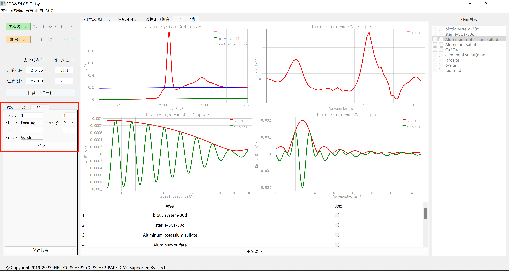

# PCA&LCF程序

## 程序下载和安装

点击下载： [软件包](https://docs.ihep.ac.cn/link/AAF9A02D2FDEF64AED9BB07E00D1414ED4)

本程序无需安装，下载之后解压即可直接使用。

## 程序启动
我们只需点击“PCA-LCF.exe”图标即可进入PCA-LCF处理程序，界面如下图所示。

## 扣背底/归一化
进入该程序界面后，我们只需要点击“实验谱目录”按钮选择待处理的实验谱目录，此时会自动加载样品数据并在界面右侧的样品列表中显示样品名称，
如下图所示。

同样的，我们选取任意一个文件夹作为我们结果输出文件夹。

在读入数据后，我们点击“扣背底/归一化”按钮即可对所有的样品和标样数据进行扣背底/归一化处理，如下图所示。在得到结果后，我们可以点击图10表格所示的选择按钮对样品/标样进行显示选择，点击“重新绘图后”即可进行所选择数据的图形显示。下图绘图区域左图即为所选择的数据显示，右图会显示所有的样品数据的归一化之后的谱线。

此外，我们还可以对边前范围和变后范围进行自定义调整，除了手动输入边前边后范围的方式，我们还可以选择从图中选点的方式确定边前边后范围。勾选“图中选点”进入功能，此时边前边后范围都会显示一个单选框；选择一个需要更改的范围；之后将鼠标移动到“抠背底/归一化”标签页的左侧图中，会出现一个跟随鼠标的红色十字线，同时左侧图左上角会显示坐标信息；根据需要点击鼠标左键则会更改对应的边前边后范围值；反选“图中选点”功能，退出功能；最后，点击“重新绘图”即可根据当前选择的边前边后范围对单个样品进行抠背底/归一化操作，同时图和对应的表也会更新信息。如下图所示。

## PCA处理
在完成扣背底归一化之后，我们进行主成分（PCA）分析。这里，我们需要对PCA训练数据和PCA拟合数据进行选择，但是需要确保训练数据量大于2。我们可以选择任意的样品进行PCA训练和PCA拟合操作，如图右侧样品列表所示，第一列为训练数据源，第二列为拟合数据源，当我们点选任意一个样品时，则会在左侧对应的区域显示，反选之后，左侧对应区域也会去掉该样品的显示。点击“训练”按钮，则会执行PCA训练操作，同时在“PCA”标签页的绘图区域左侧显示PCA成分分解图；点击“拟合”按钮，则会执行PCA拟合操作，拟合操作是在训练操作之后进行的，其拟合结果显示在绘图区域右侧，其PCA分解权重如下图右下角左表所示。我们可以通过点击如图11右下角的右表所示的“选择”按钮，再点击“选择样品”进行该样品的PCA拟合结果查看。

## LCF处理
对于样品的LCF拟合，我们需要对LCF的样品和组分分别进行选择。如图右侧样品列表所示，第一列为样品列表，第二列为组分列表，当我们点选任意一个样品时，则会在左侧对应的区域显示，反选之后，左侧对应区域也会去掉该样品的显示。点击“线性组分拟合”按钮，则会执行LCF操作，其拟合的结果以及各标样的占比如图12绘图区域的两个图所示，其具体的拟合评价指标如图12左表格所示。我们可以通过点击如下图右表所示的“选择”按钮，再点击“重新绘图”进行该样品的LCF拟合结果查看。

## EXAFS常规处理
如果吸收谱数据含扩展边数据，我们也会对吸收谱数据进行EXAFS常规处理。我们点击如下图所示的“EXAFS常规处理”按钮进行切换。在对K-range, window, R-range等设置完成后，可点击下方的“EXFAS常规处理”按钮完成实验谱的EXAFS常规处理，其结果如下图右图所示。

## 结果保存
程序的处理结果会保存在我们设置好的结果保存路径（PCALCF_output), 我们将四个操作的结果分别保存到对应文件夹下，例如抠背底/归一化操作的结果放在Normalization文件夹下。对于每一个存放在样品文件夹中的未知样品，如图17所示，我们都会生成以样品文件名为文件夹名的文件夹进行相应结果保存。在每个文件夹中也会生成PCA和LCF两个文件夹进行对应图形和数据的保存。其中，对于PCA，我们不仅保存了未知样品扣背底和PCA拟合结果/对应残差的图形，而且对相应的PCA拟合权重和PCA拟合的数据进行了保存。对于LCF，我们也保存了LCF拟合结果/对应残差和对应权重的图形。我们把相应标样拟合权重的数据保存在了lcf_fit_report文件中。我们也把相应的LCF拟合数据保存在了lcf_fit_data以及lcf_components_data表格中。此外，我们还在data_norm文件夹中保存所有在实验站上测试的样品的批量归一化数据。

