# HXMT web 数据分析平台

## 1. 介绍

&emsp;&emsp;本应用将 HXMT 数据处理流程进行可视化，以 web 页面的形式为用户提供服务。主要有以下特点：
- 前端基于 Jupyterlab 生态，通过 web 浏览器为用户提供软件、算法开发以及数据处理环境。
- 开箱即用，用户不用下载、安装软件和配置计算环境。服务始终保持最新版本。
- 资源弹性可伸缩，根据不同的数据处理任务配置不同的资源规模。
- 不受操作系统、地域限制，随时随地可以通过浏览器访问服务。
- 终端+用户友好界面，适合不同专业程度的用户。

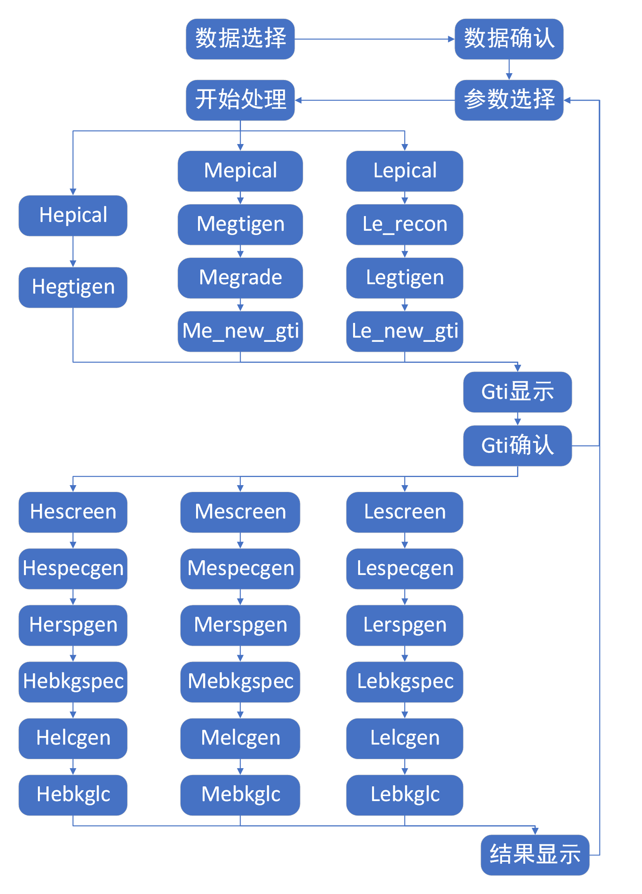


## 2.用户登录

&emsp;&emsp;在浏览器地址栏输入 https://sdccompute.ihep.ac.cn/ ，进入登录界面，点击“Sign in with IHEPSSO”进入高能所统一认证系统界面。在统一认证系统界面中进行用户身份认证。用户登录之后即可进入服务选取界面。

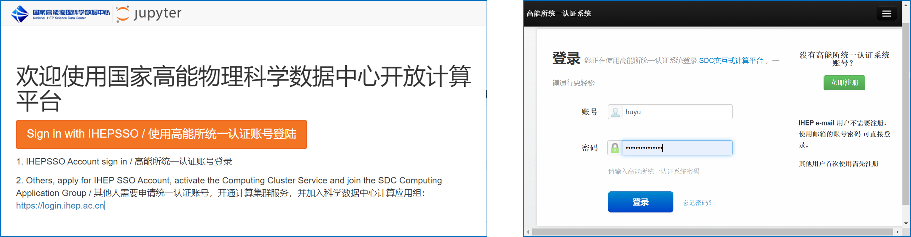

:::{admonition} Tips
&emsp;&emsp;该服务需要/sdcfs/hepdata/Astro/HXMT/ 下 1L/ 目录中各数据文件的读权限以及/temp/目录的写权限，HXMT 用户默认拥有这些权限，其他用户需要联系管理员设置。
:::

## 3.数据处理服务选择
&emsp;&emsp;在数据处理服务选取界面中选取 ‘HXMT data analysis’选项，点击页面顶部 ‘启动已选择的分析环境’ 按钮进入用户 Jupyterlab 界面。JupyterLab 是一种基于 web 的集成开发环境，可以用于编写 notebook、操作终端、编辑 markdown 文本、打开交互模式、查看csv文件及图片，以及开发学科应用。

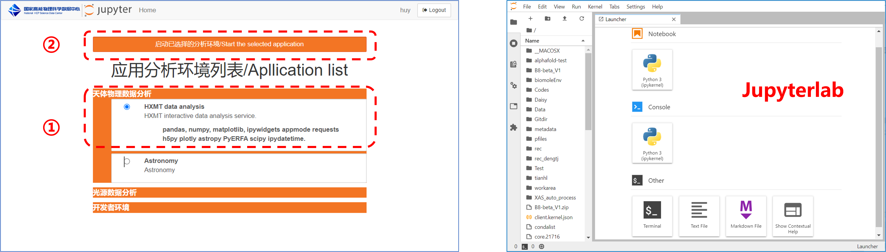

## 4.计算环境设置

&emsp;&emsp;待进入 jupyterlab 界面之后就可以看到右边的‘launcher’窗口。点击左上方菜单栏下面的+号图标可以新建‘launcher’窗口。在‘launcher’窗口的 other 部分中点击‘Terminal’图标，进入shell界面。在shell界面中执行命令：
```shell
cd ~
source sourceEnv.sh
```

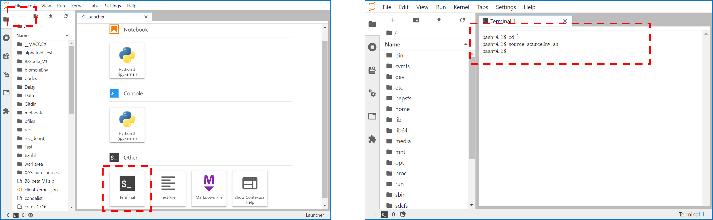

## 5. 数据处理应用界面
&emsp;&emsp;在‘launcher’窗口下方有一栏“IHEP Application”,点击该栏中的 “HXMT”图标可以直接跳转到应用界面。如果启动失败，可以关闭跳转界面，重新点击“HXMT”图标。

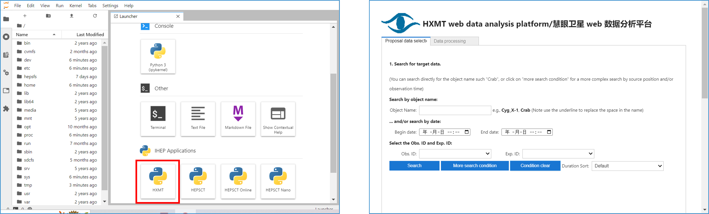

## 6.数据处理工作流

### 6.1 数据选择与确认

&emsp;&emsp;默认情况下，用户可以通过源名称或者/以及观测日期搜索筛选数据。用户填好源名称或者选择好观测日期之后点击“Search”按钮之后，界面将列出所有可选的观测号。下方表格将显示更多数据相关的信息。
用户在观测号列表选择观测号之后，界面将列出所有可选的曝光号。用户选择曝光号之后，后台将自动解析数据文件目录，如果数据文件不存在，将在下方log模块中提示用户。数据详细信息表格可以按照观测时长进行重新排序。

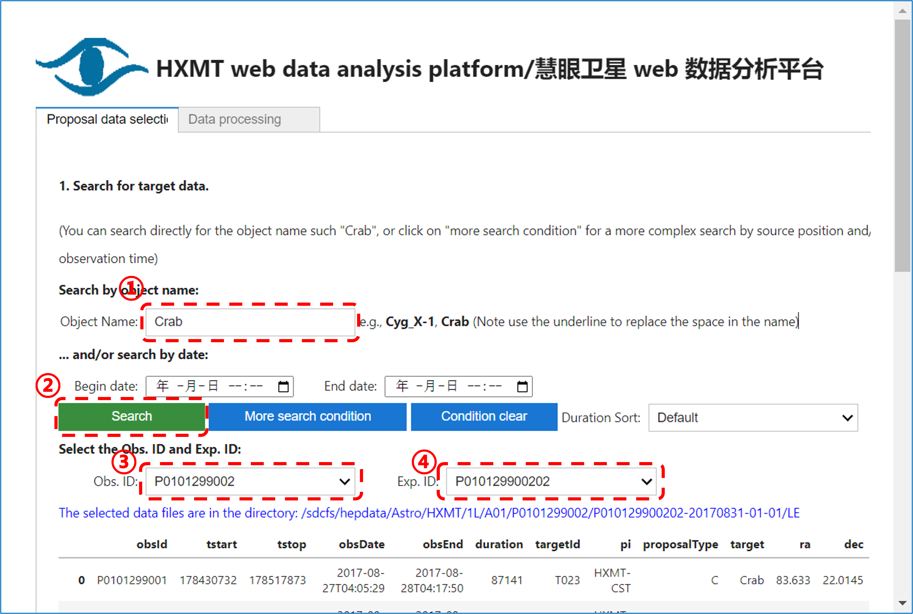

&emsp;&emsp;除了默认的按源名称或者/以及观测日期，用户还可以使用更多的条件进行数据筛选。点击‘More search condition’按钮可以调出更多的筛选条件。更多可选的条件包括：坐标，提案类型，提案号，观测起始时间等。点击’Simplify search condition’可以收起不常用的筛选条件。如果想重置筛选条件可以点击‘Condition clear’按钮。确定数据文件存在之后，用户即可进入‘Data process’页面进行数据处理。

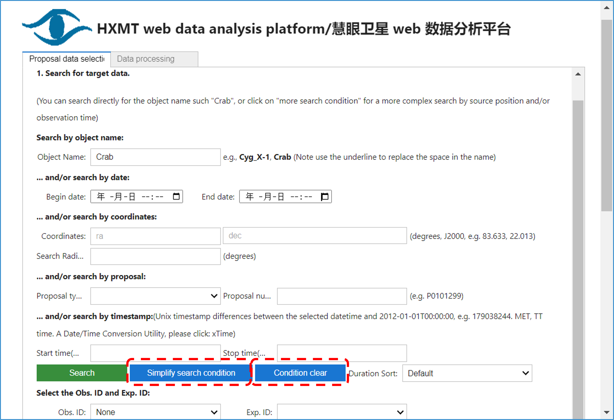


### 6.2 参数选择

&emsp;&emsp;确认相关数据文件存在之后，即可切换到 ‘Data process’ 页面进行参数选择和数据处理。
用户输入的初始参数按照处理对象分组：
- GTIs 选择条件
- 产生光变曲线参数
- 视场选择参数
- 与源相关的参数

&emsp;&emsp;其中，视场选择参数支持所有视场（默认）、某一视场、某两个视场等多种组合选择。

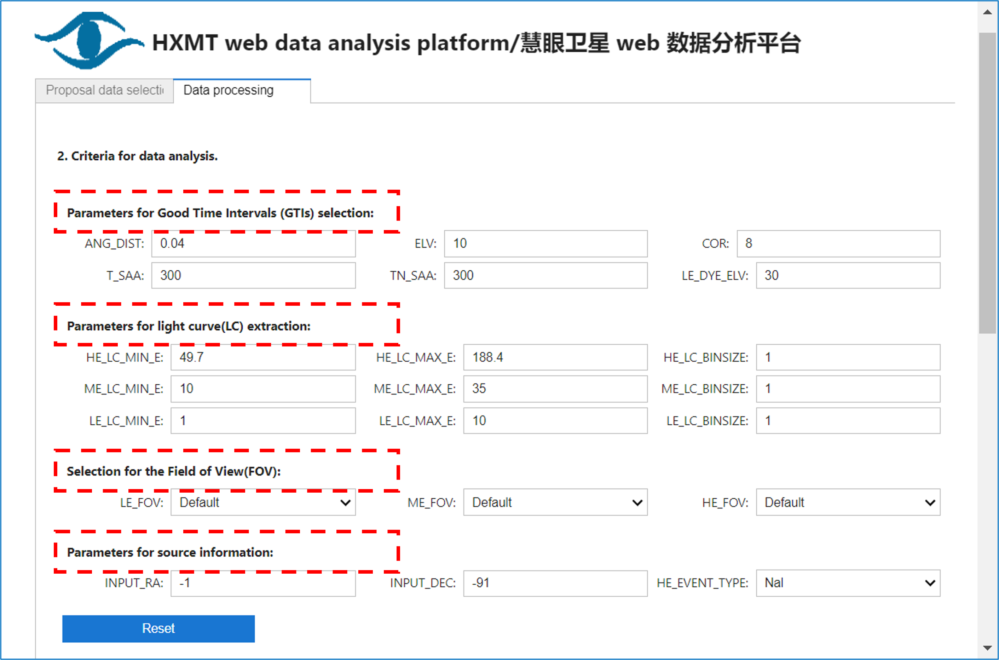

### 6.3 数据处理主流程

&emsp;&emsp;设置好参数之后，点击 “Start run” 按钮进行初步分析，此时按钮颜色变为红色，显示为‘running’。待初步分析成功结束之后，按钮颜色变为绿色，显示恢复为‘Start run’。在数据处理过程中，用户可以点击”Stop”终止执行过程。

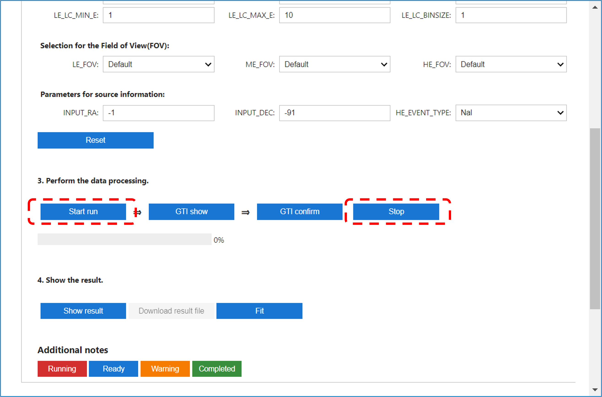

&emsp;&emsp;运行结束之后，点击 ”GTI show” 按钮图形化显示 GTI 结果。

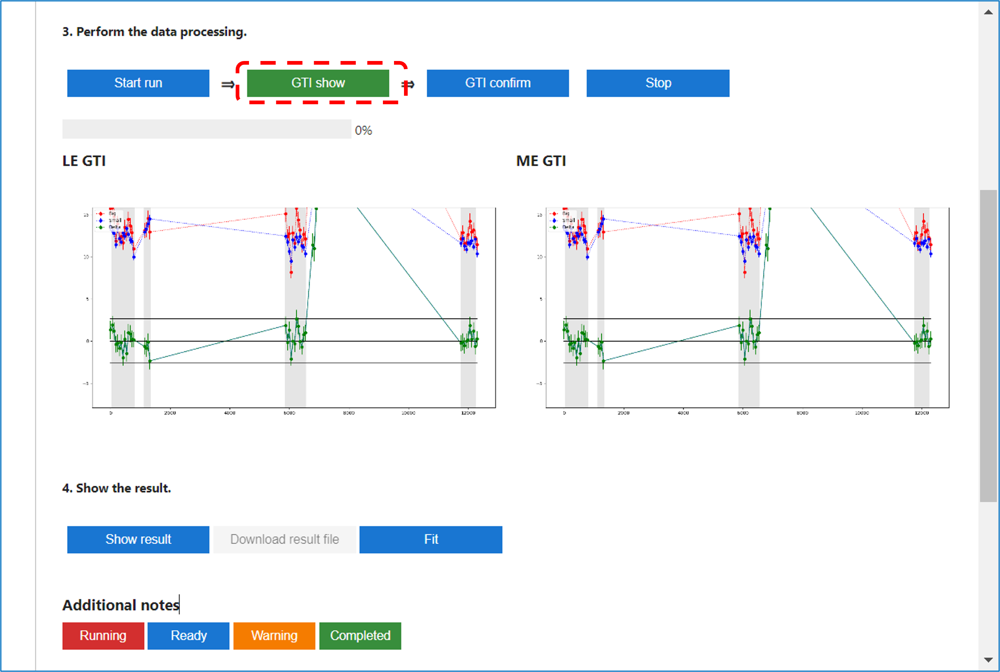

&emsp;&emsp;用户通过查看 GTI 结果确认参数是否设置正确。确认无误之后，点击 “GTI confirm” 按钮进行最终分析，此时按钮颜色变为红色，显示为‘Running’。待最终分析成功结束之后，“GTI confirm”按钮状态恢复，显示为绿色。点击 “Show result” 按钮，显示最终分析结果。

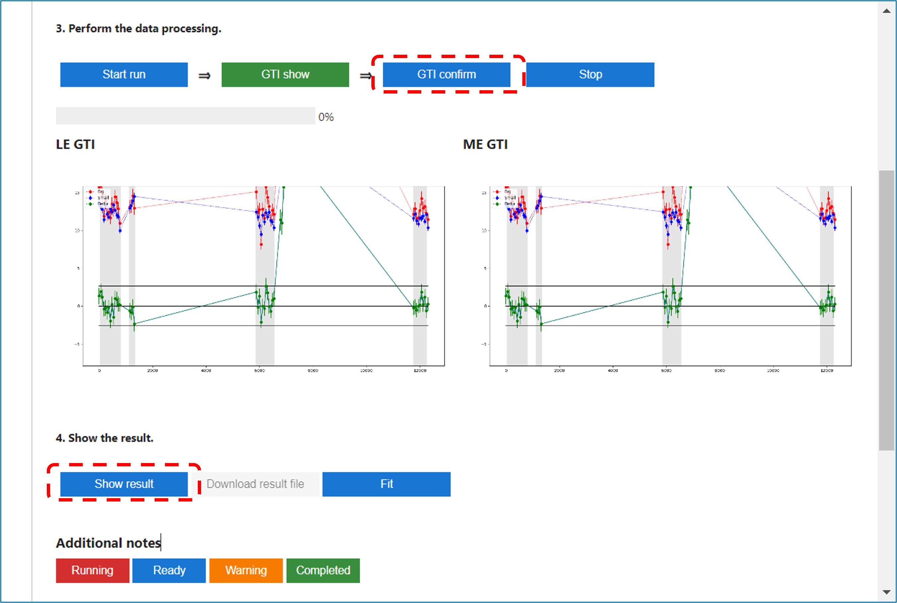

&emsp;&emsp;本应用支持光变曲线，能谱和功率谱这三种分布的显示。本应用可以对能谱进行简单的拟合（幂律），点击‘Fit’按钮即可对能谱进行拟合，拟合结果将显示在数据处理结果可视化下方。

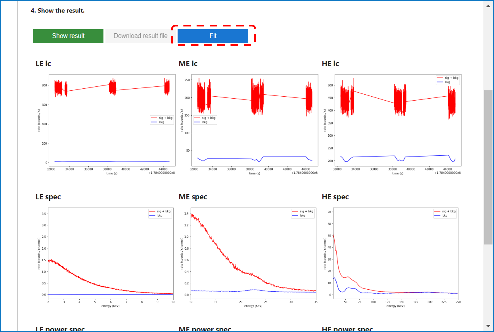

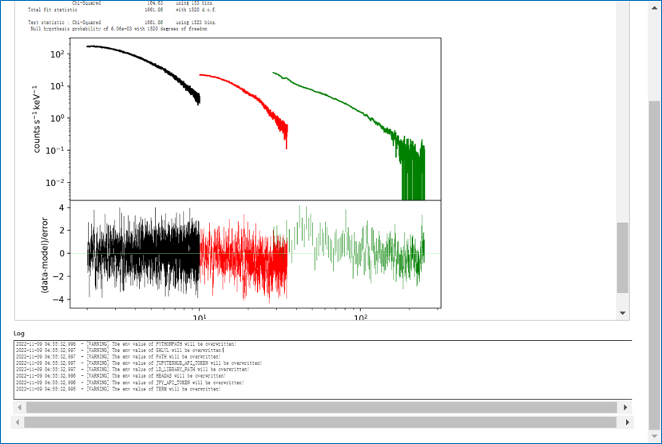


## 7.日志，用户临时目录，按钮说明

&emsp;&emsp;当用户启动服务 GUI 时，会自动为用户创建一个临时目录/sdcfs/hepdata/Astro/HXMT/temp/${USER}/。

&emsp;&emsp;当确定观测号以及曝光号之后，在用户临时目录下面会自动创建一个特定观测号的分析结果目录。 /sdcfs/hepdata/Astro/HXMT/temp/${USER}/obsID/。在该目录下面不同曝光号的分析结果文件以曝光号开头。

&emsp;&emsp;分析结束之后每个曝光号会有一个日志文件：/sdcfs/hepdata/Astro/HXMT/temp/${USER}/obsID/expID.log

按钮颜色含义：


## 8.数据文件下载

&emsp;&emsp;用户初筛数据一般位于目录： /sdcfs/hepdata/Astro/HXMT/temp/${USER}/。从 jupyterlab左边目录栏通过点击可以进入到该目录下面。可以通过右键单击该文件，在右键菜单中找到‘Download’选项进行下载。
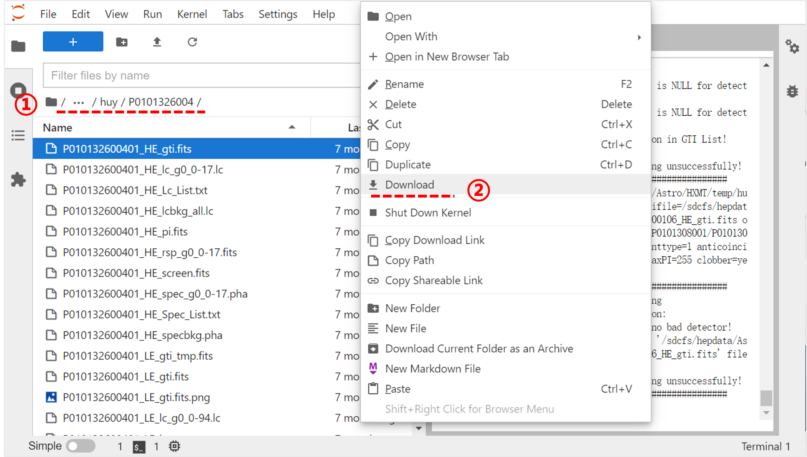


