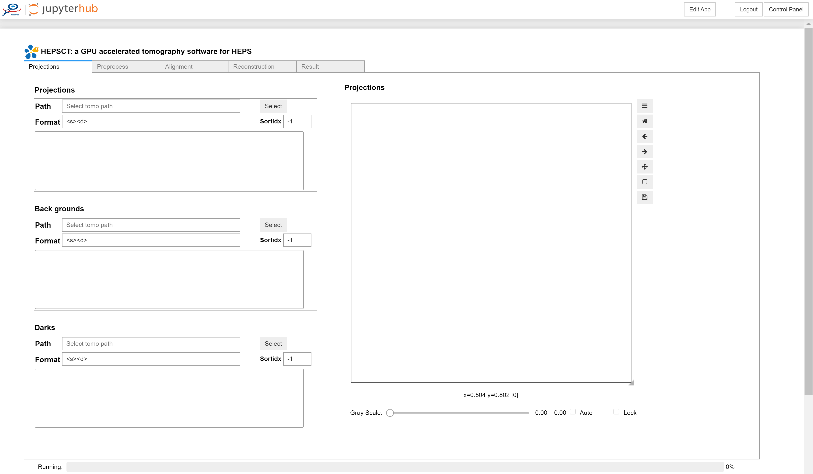
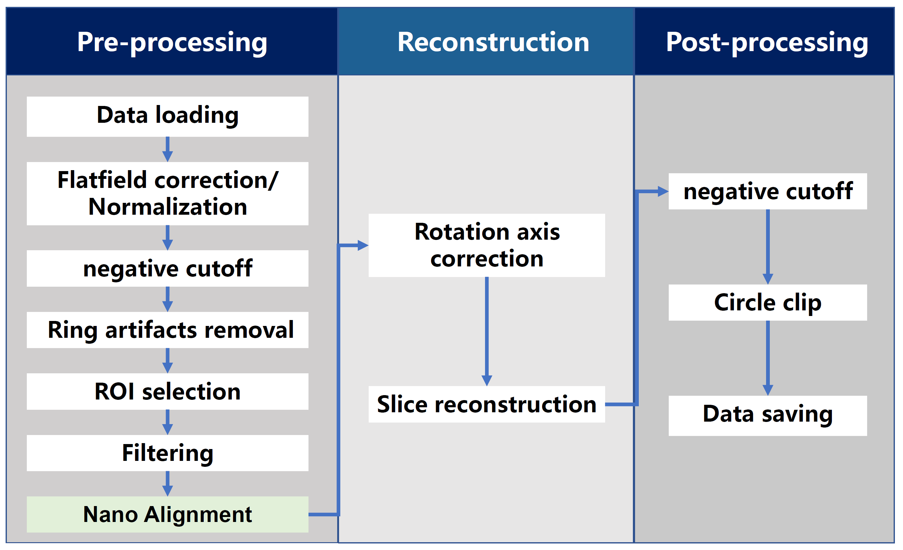

# HEPSCT

HEPSCT 是 HEPSCC 开发的基于 web 的CT数据处理应用。包含图像导入、预处理、相位恢复（待集成）以及图像重建和数据分析等模块。能够实现CT数据的快速重建。从而满足国内外同步辐射用户对于“海量”X射线CT数据处理的需求。 

## 软件特点 

* 重建核心算法100%实现GPU加速, 利用多线程实现数据的快速读取及IO、CPU、GPU数据处理同步进行 
* 实现多尺度CT重建转轴位置的自动校正，基于小波变换进行环形伪影的去除  
* 提供FBP、Grid、EM等多种重建算法，利用Grid网格算法能够在数秒内完成对图像尺寸为2k*2k的投影数据集的三维重建计算 

HEPSCT 的前端基于Jupyterlab生态，由ipywidgets包开发。

HEPSCT 后端集成了HEPS X射线显微成像线站团队开发的MOCUPY，该软件基于CUDA以及Python编写，基于GPU加速CT图像重建。

## 软件访问方式

### 账号申请
如果没有高能所统一认证账号，请先[申请统一认证账号](http://login.ihep.ac.cn/)， 并申请AFS集群账号，隶属应用请选择 "HEPS"，用户组请选择“HEPSBL”。

### 软件访问
本软件以web页面的形式为用户提供服务，用户不需要下载和安装软件。在浏览器中输入访问地址： https://hepscompute.ihep.ac.cn ， 点击“Sign in with IHEPSSO”按钮，使用高能所统一认证账号登录。登录之后进入服务选择页面，选择 cumopy 项，点击页面最下方“start” 按钮，进入 Jupyterlab 界面。在 Jupyterlab 界面中的“IHEP Application” 栏目中点击 “HEPSCT” 图标即可进入 HEPSCT 界面。

## 数据类型及相关说明

### 支持的数据类型及格式说明

HEPSCT 可以接受 TIFF（未压缩的Tiff，8bit uint，16bit uint和32bit float）或者 HDF5 格式的图像。输出是 32bit float型TIFF图像的数据集。

为了保证数据的顺利读入，对数据格式有以下要求，
-  TIFF格式的数据，所有图像的索引号的数据位数应该相同，可以通过在小的索引号前加0实现。例如：tomo_0001, tomo_0002……tomo_0180; flat_0001, dark_0001等。
-  HDF5格式的数据需要遵循 HEPS 成像线站的数据格式。

### 定义说明

1. Projections: CT数据采集过程中，在有光的模式下，有样品时的投影图像；
2. Background：CT数据采集过程中，在有光的模式下，没有样品时的背景（平场）图像；
3. Dark：CT数据采集过程中在没有光的情况下采集的图像；

## HEPSCT 界面及操作

HEPSCT 软件的界面如下图所示，其中包含5个选项卡页，每个选项卡的具体功能如下：

- Projections：图像的导入，包含投影、背景以及暗场图像的导入和预览；
- Preprocess: 重建预处理，包含降噪、扣除背景、去除负值、选区、背景归一化以及投影图Line Profile预览等功能；
- Alignment： 图像的抖动校正，提供手动和自动两种校正模式；
- Reconstruction： 包含重建算法选择、环形伪影去除、参数设置、转轴矫正以及切片预览等功能
- Result: 重建结果查看

HEPSCT 数据处理模式及流程如下图所示，主要包括数据加载，预处理，图像校正，数据重建，以及后处理：

# 微米CT数据重建流程

微米CT数据重建流程，主要包括图像导入、背景扣除（预处理）以及重建共三部分。具体重建流程和界面操作如下：

## 图像导入

1) 点击Load Image切换至图像导入页面；
2) 点击2 Load按钮导入投影数据；
3) 检查起始角度（默认0°，编号3）和终止角度（默认180°，编号4）的数值是否与实验采集实际情况一致；若不一致，在3、4方框内中输入正确数值；
4) 点击5 Load按钮，导入背景数据；
5) 点击6 Load按钮，导入暗场数据；
注：若实验过程中未采集背景或暗场数据，可不导入，直接跳过。

## 背景扣除（预处理）

点击Preprocess Tab进入预处理页面（如下图所示）。

1) 图像降噪算法选择（注：可根据实际情况选择算法，默认是None）；
2) 背景扣除,具体计算公式如下：

$$
I_out = -log \frac{I_prj - I_dark}{I_bg - I_dark}
$$

（注：默认勾选，若没有背景数据导入，需要取消勾选）
3) 去除图像中出现的负值，可选择是否勾选；
4) 拖动Projection的滑动条改变预览的投影图，通过点击Manual Preview（编号5）按钮，可以手动更新预览图像；或者勾选Auto Update（编号6）选项，自动更新预览图像；
5) 若需要对投影图像进行选区重建，勾选ROI选项（编号7），在图像显示区域点击鼠标左键并拖动进行图像选区，确定区域后，点击Set ROI按钮（编号8）即可完成选区（如图中红色虚线部分所示）；如需取消已选区操作，可点击Clear按钮（编号11）；
6) 若需要对投影图像进行背景归一化，勾选Background ROI选项（编号9），在图像显示区域，没有样品的区域，点击鼠标左键并拖动进行图像选区，确定区域后，点击Set BgROI按钮（编号10）即可完成选区（如图中蓝色虚线部分所示）；（注：该区域选择不能超过300*300，若样品占满整个区域，这步可跳过）

## 重建 

点击Reconstruction Tab进入重建页面（如下图所示）。

1) 重建算法选择：FBP、grid（速度快）、EM等多种算法（默认grid）；
2) 迭代次数，默认20；
3) 每次重建的切片张数，与计算机性能（内存）相关，默认64（可根据计算机的性能适当减小或增大）；
4) 起始角度：根据实际数据采集输入，默认0；
5) 终止角度：根据实际数据采集输入，默认180；
6) 根据导入的投影图数量和4、5的输入计算得到的值。在重建之前需要检查step size是否正确；
7) 对重建区域进行mask，在mask圆外的值都为0，可按照实际情况选择是否勾选；
8) 对重建后的图像中的负值进行去除，可按照实际情况选择是否勾选；
9) 对重建后的切片进行环形伪影去除，建议勾选；
10) 最终重建时是否异步，默认不勾选，可根据电脑配置选择是否勾选。
11) 拖动Slice滑动条可以改变当前重建切片的层数；
12) 点击Guess Axis按钮（编号12）可以通过算法计算转轴的值；
13) 若12）中计算的转轴值不准确，可拖动Axis滑动条改变重建的转轴，寻找精确的重建转轴的值；
14) “+/-”按钮（编号14）是13）中滑动条的精细调节，每点一次转轴数值变化0.5；
15) 手动预览重建切片结果，每次改变参数后，预览均需点击Manual Update按钮（编号15）；
16) 若打勾，自动预览重建切片结果，则每次参数改变均自动重建并显示结果；
17) 若样品较大，上层和下层转轴数值差异较大，分别确定上层和下层的转轴值，然后中间通过算法插值，得到转轴值。具体操作见（17.18）
18) 可向左拖动Slice滑动条（编号11），选择上层的Slice，重复12）至14）步骤，找到最合适的转轴，点击set Axis1;（经过此步骤可确定上层的转轴）
19) 与17）操作类似，向右拖动Slice滑动条（编号11），选择下层的Slice，重复12）至14）步骤，找到最合适的转轴，点击set Axis2;（经过此步骤可确定下层的转轴）
20) 点击Folder按钮，选择重建结果保存路径；
21) 点击Reconstruction按钮(编号20)开始扫描；
22) 若需要中途停止采集点击Stop按钮(编号21)。

