# HEPSCT

HEPSCT 是 HEPSCC 开发的基于 web 的CT数据处理应用。包含图像导入、预处理、相位恢复（待集成）以及图像重建和数据分析等模块。能够实现CT数据的快速重建。从而满足国内外同步辐射用户对于“海量”X射线CT数据处理的需求。 

## 软件特点 

* 重建核心算法100%实现GPU加速, 利用多线程实现数据的快速读取及IO、CPU、GPU数据处理同步进行 
* 实现多尺度CT重建转轴位置的自动校正，基于小波变换进行环形伪影的去除  
* 提供FBP、Grid、EM等多种重建算法，利用Grid网格算法能够在数秒内完成对图像尺寸为2k*2k的投影数据集的三维重建计算 

HEPSCT 的前端基于Jupyterlab生态，由ipywidgets包开发。

HEPSCT 后端集成了HEPS X射线显微成像线站团队开发的MOCUPY，该软件基于CUDA以及Python编写，基于GPU加速CT图像重建。

## 软件访问方式

### 账号申请
如果没有高能所统一认证账号，请先[申请统一认证账号](http://login.ihep.ac.cn/)， 并申请AFS集群账号，隶属应用请选择 "HEPSBL"，用户组请选择“hepsbl”。

### 数据的上传和下载
本应用部署在计算中心交互式计算平台上，该平台挂载计算中心分布式文件存储系统。使用本应用处理数据需要首先将数据上传至计算中心分布式文件存储系统中。具体方法如下：

以AFS集群账号 huy 为例，在申请了AFS账号，并选择“hepsbl”用户分组后，计算系统会在 /hepsfs/user/ 目录下自动为用户创建用户目录 /hepsfs/user/huy.用户在Windows 电脑上可以通过 WinSCP 软件进行数据的上传和下载。WinSCP软件下载地址 https://winscp.net/eng/download.php。

数据上传的步骤为：

1. 启动WinSCP软件，一般会弹出登录界面，如果没有弹出可以点击左上方的“新建会话”。

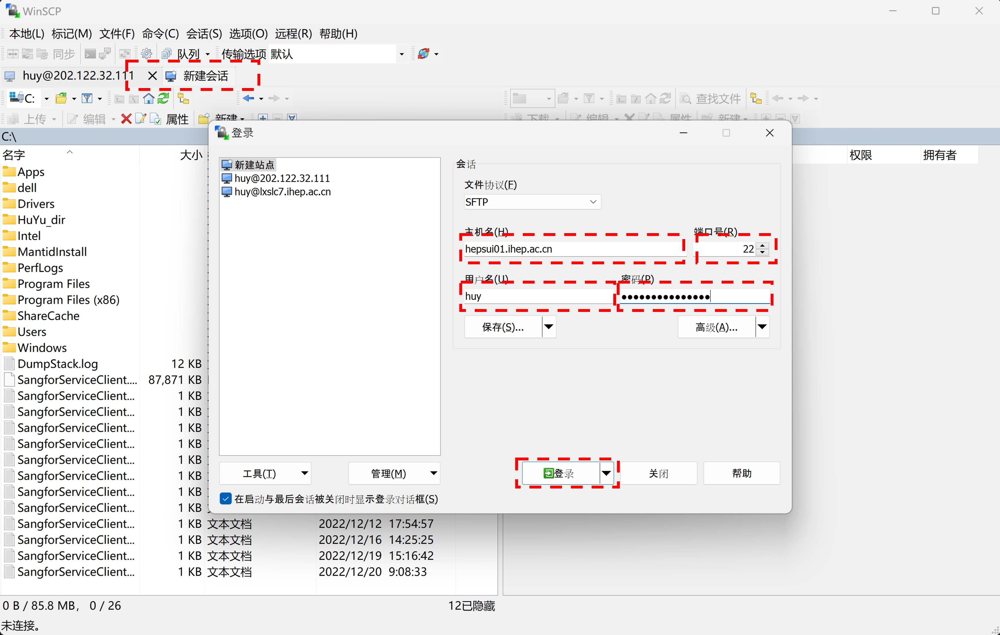

2. 在登录窗口右上方填入登录信息：

   - 主机名：hepsui01.ihep.ac.cn
   - 用户名： bsrf4w1a
   - 密   码： ********** 

3. 点击右下方点击“登录”按钮登录。
4. 登录成功后，进入工作界面：左侧是 windows 目录，右侧是 hepsfs 盘上用户的数据存放目录。
  
   - 在左侧是 windows 目录中找到需要处理的数据，使用鼠标将数据文件从数据存放目录拖拽到右侧 hepsfs 的目录中，即可完成数据的上传。
   - 在右侧是 hepsfs 盘上找到处理好数据，使用鼠标将数据文件从数据存放目录拖拽到左侧的 windows目录中，即可完成数据的下载。

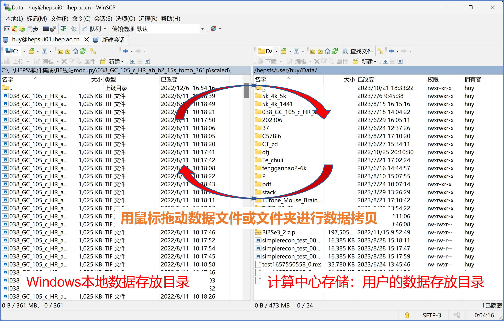

:::{admonition} Tip
:class: tip
第2步中的登录会话可以保存，避免下次登录重复输入登录信息。
:::

### 软件访问
本软件以web页面的形式为用户提供服务，用户不需要下载和安装软件。在浏览器中输入访问地址： https://hepscompute.ihep.ac.cn， 点击“Sign in with IHEPSSO”按钮，使用高能所统一认证账号登录。登录之后进入服务选择页面，选择 cumopy 项，点击页面最下方“start” 按钮，进入 Jupyterlab 界面。在 Jupyterlab 界面中的“IHEP Application” 栏目中点击 “HEPSCT” 图标即可进入 HEPSCT 界面。

## 数据类型及相关说明

### 支持的数据类型及格式说明

HEPSCT 可以接受 TIFF（未压缩的Tiff，8bit uint，16bit uint和32bit float）或者 HDF5 格式的图像。输出是 32bit float型TIFF图像的数据集。

为了保证数据的顺利读入，对数据格式有以下要求，
-  TIFF格式的数据，所有图像的索引号的数据位数应该相同，可以通过在小的索引号前加0实现。例如：tomo_0001, tomo_0002……tomo_0180; flat_0001, dark_0001等。
-  HDF5格式的数据需要遵循 HEPS 成像线站的数据格式。

### 定义说明

1. Projections: CT数据采集过程中，在有光的模式下，有样品时的投影图像；
2. Background：CT数据采集过程中，在有光的模式下，没有样品时的背景（平场）图像；
3. Dark：CT数据采集过程中在没有光的情况下采集的图像；

## HEPSCT 界面及操作

HEPSCT 软件的界面如下图所示，其中包含5个选项卡页，每个选项卡的具体功能如下：

- Projections：图像的导入，包含投影、背景以及暗场图像的导入和预览；
- Preprocess: 重建预处理，包含降噪、扣除背景、去除负值、选区、背景归一化以及投影图Line Profile预览等功能；
- Alignment： 图像的抖动校正，提供手动和自动两种校正模式；
- Reconstruction： 包含重建算法选择、环形伪影去除、参数设置、转轴矫正以及切片预览等功能
- Result: 重建结果查看

HEPSCT 数据处理模式及流程如下图所示，主要包括数据加载，预处理，图像校正，数据重建，以及后处理：

# 微米CT数据重建流程

微米CT数据重建流程，主要包括图像导入、背景扣除（预处理）以及重建共三部分。具体重建流程和界面操作如下：

## 图像导入

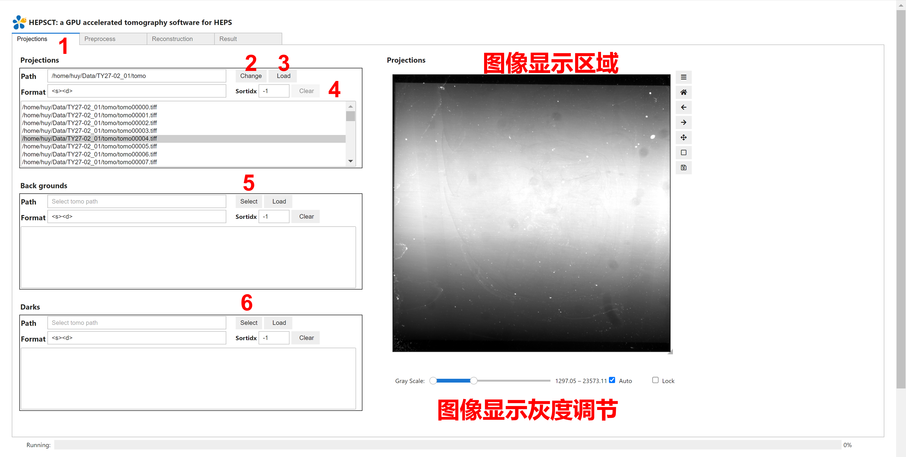

1) 点击 Projections 切换至图像导入页面；
2) 点击 (编号2) Change 按钮选择所需导入投影数据的路径；
3) 在下方文件列表中选择文件，点击 (编号3) Load 按钮可以导入目录下部分数据文件，点击(编号4) Clear 按钮可以清楚已选择的数据文件；
4) 点击 (编号5) Change 按钮，导入背景数据；
5) 点击 (编号6) Change 按钮，导入暗场数据；

:::{note} 
若实验过程中未采集背景或暗场数据，可不导入，直接跳过。 
:::

## 背景扣除（预处理）

点击 Preprocess Tab 进入预处理页面（如下图所示）。

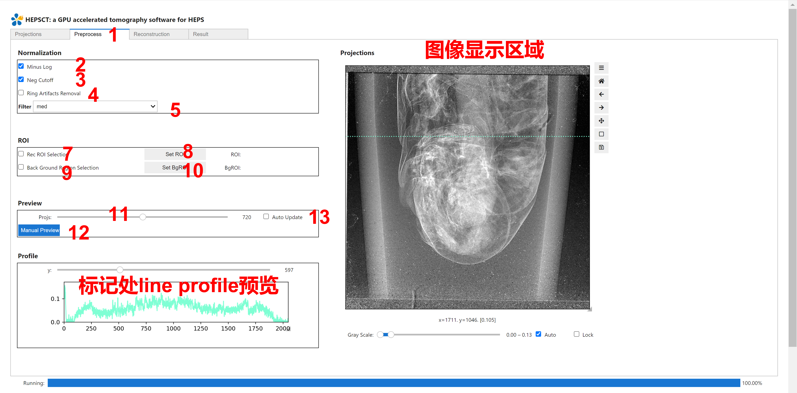

1) 图像降噪算法选择 (编号5)（注：可根据实际情况选择算法，默认是None）；
2) 背景扣除,具体计算公式如下：

$$
I_out = -log \frac{I_prj - I_dark}{I_bg - I_dark}
$$

（注：默认勾选，若没有背景数据导入，需要取消勾选。） 

3) 去除图像中出现的负值，可选择是否勾选(编号3)；
4) 对重建后的切片进行环形伪影去除，建议勾选 (编号4)；
5) 拖动Projection的滑动条改变预览的投影图，通过点击 Manual Preview（编号12）按钮，可以手动更新预览图像；或者勾选 Auto Update（编号13）选项，自动更新预览图像；
6) 若需要对投影图像进行选区重建，勾选 ROI 选项（编号7），在图像显示区域点击鼠标左键并拖动进行图像选区，确定区域后，点击 Set ROI按钮（编号8）即可完成选区（如图中红色虚线部分所示）；如需取消已选区操作，可单击选框，按 backspace 键 删除；
7) 若需要对投影图像进行背景归一化，勾选 Background ROI 选项（编号9），在图像显示区域，没有样品的区域，点击鼠标左键并拖动进行图像选区，确定区域后，点击 Set BgROI 按钮（编号10）即可完成选区（如图中蓝色虚线部分所示）；

:::{note} 
该区域选择不能超过300*300，若样品占满整个区域，这步可跳过。 
:::

## 重建 

点击Reconstruction Tab进入重建页面（如下图所示）。

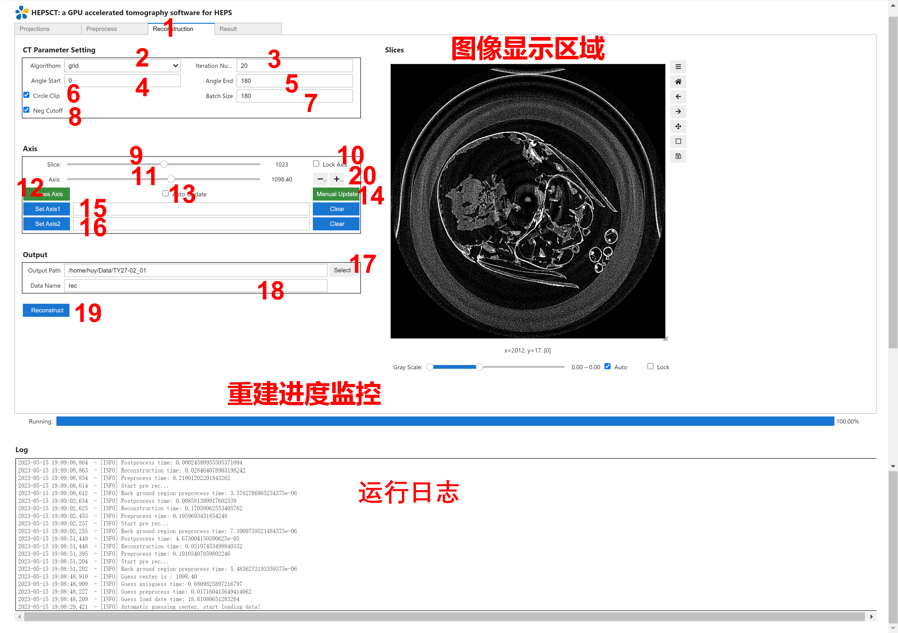

1) 重建算法选择：FBP、grid（速度快）、EM等多种算法（默认grid）（编号2）；
2) 迭代次数，默认20（编号3）；
3) 起始角度：根据实际数据采集输入，默认0 （编号4）；
4) 终止角度：根据实际数据采集输入，默认180 （编号5）；
5) 每次重建的切片张数，与计算机性能（内存）相关，默认180（可根据计算机的性能适当减小或增大）（编号7）；
7) 对重建区域进行 mask，在mask圆外的值都为0，可按照实际情况选择是否勾选（编号6）；
8) 对重建后的图像中的负值进行去除，可按照实际情况选择是否勾选 （编号8）；
9) 拖动Slice滑动条可以改变当前重建切片的层数 （编号9）；
10) 点击 Guess Axis按钮（编号12）可以通过算法计算转轴的值；
11) 若12）中计算的转轴值不准确，可拖动 Axis 滑动条改变重建的转轴，寻找精确的重建转轴的值；
12) “+/-”按钮（编号20）是 (编号11) 中滑动条的精细调节，每点一次转轴数值变化 0.1；
13) 手动预览重建切片结果，每次改变参数后，预览均需点击 Manual Update 按钮（编号14）；
14) (编号10) 若打勾，自动预览重建切片结果，则每次参数改变均自动重建并显示结果；
15) 若样品较大，上层和下层转轴数值差异较大，分别确定上层和下层的转轴值，然后中间通过算法插值，得到转轴值。具体操作见（16，17）
16) 可向左拖动 Slice 滑动条（编号 9），选择上层的 Slice，重复12）至14）步骤，找到最合适的转轴，点击set Axis1;（经过此步骤可确定上层的转轴）
17) 与 16）操作类似，向右拖动Slice滑动条（编号11），选择下层的Slice，重复 10）至 12）步骤，找到最合适的转轴，点击 set Axis2;（经过此步骤可确定下层的转轴）
18) 点击 （编号17） 按钮，选择重建结果保存路径；
19) 点击 Reconstruction按钮 (编号19) 开始扫描；

## 重建结果查看

点击Result Tab进入重建页面（如下图所示）。

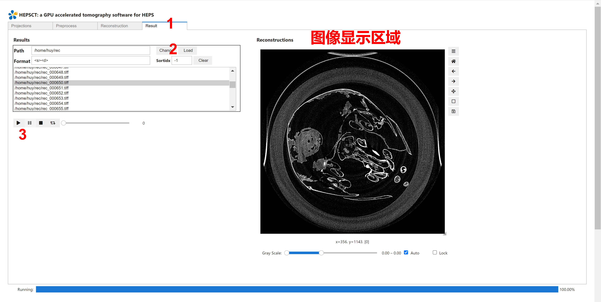

1) 点击 (编号2) Select 按钮导入重建断层数据；
2) 点击下方列表查看重建结果
3) 也可以点击 (编号3) Play 按钮，自动播放重建结果

# 纳米CT数据重建流程

纳米CT数据重建流程，主要包括图像导入、背景扣除（预处理）、图像抖动校正以及重建共四部分。具体重建流程和界面操作如下：

## 图像导入

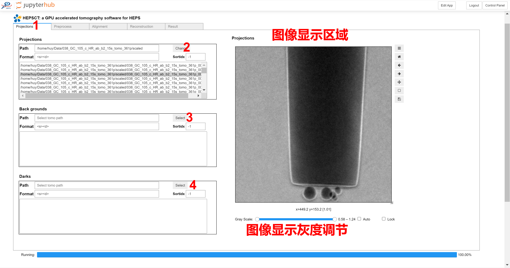

1) 点击 Projections Tab 切换至图像导入页面；
2) 点击 (编号2) Change 按钮导入投影数据；
4) 点击 (编号3) Change 按钮，导入背景数据；
5) 点击 (编号4) Change 按钮，导入暗场数据；
注：若实验过程中未采集背景或暗场数据，可不导入，直接跳过。

## 背景扣除（预处理）

点击 Preprocess Tab 进入预处理页面（如下图所示）。

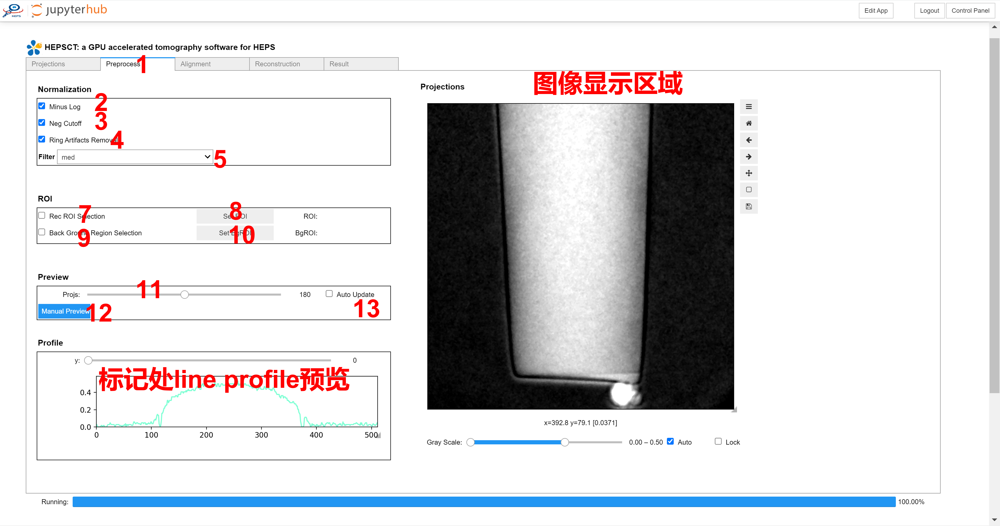

1) 图像降噪算法选择 (编号5)（注：可根据实际情况选择算法，默认是None）；
2) 背景扣除 (编号2),具体计算公式如下：

$$
I_out = -log \frac{I_prj - I_dark}{I_bg - I_dark}
$$

（注：默认勾选，若没有背景数据导入，需要取消勾选。）

3) 去除图像中出现的负值 (编号3)，可选择是否勾选；
4) 对重建后的切片进行环形伪影去除(编号4)，建议勾选；
5) 拖动 Projection 的滑动条改变预览的投影图，通过点击 Manual Preview（编号12）按钮，可以手动更新预览图像；或者勾选 Auto Update（编号13）选项，自动更新预览图像；
6) 若需要对投影图像进行选区重建，勾选 ROI选项（编号7），在图像显示区域点击鼠标左键并拖动进行图像选区，确定区域后，点击 Set ROI按钮（编号8）即可完成选区（如图中红色虚线部分所示）；如需取消已选区操作，可以单击选框，按 backspace 键删除；
7) 若需要对投影图像进行背景归一化，勾选 Background ROI 选项（编号9），在图像显示区域，没有样品的区域，点击鼠标左键并拖动进行图像选区，确定区域后，点击Set BgROI 按钮（编号10）即可完成选区（如图中蓝色虚线部分所示）；

:::{note}
该区域选择不能超过300*300，若样品占满整个区域，这步可跳过。 
:::

##  图像抖动校正

由于样品转台机械稳定性的限制，消除样品转动过程中，在纳米成像实验数据采集过程中，样品台会产生随机抖动，从而影响直接重建结果。因此需要对图像进行抖动校正。HEPSCT 提供两种抖动校正模式：手动校正和自动校正。
手动校正需要对每张投影图上的标记物进行位置标记，该方法适用性强，但工作量大。自动校正是通过算法实现标记物识别并计算偏移量，对于衬度好的图像，即使没有标记物也可直接用自动校正算法进行计算。该方法省时，工作量小。可通过实验数据的实际情况选择其中一种方法进行图像抖动校正即可。以下介绍具体界面及操作。

### 手动校正

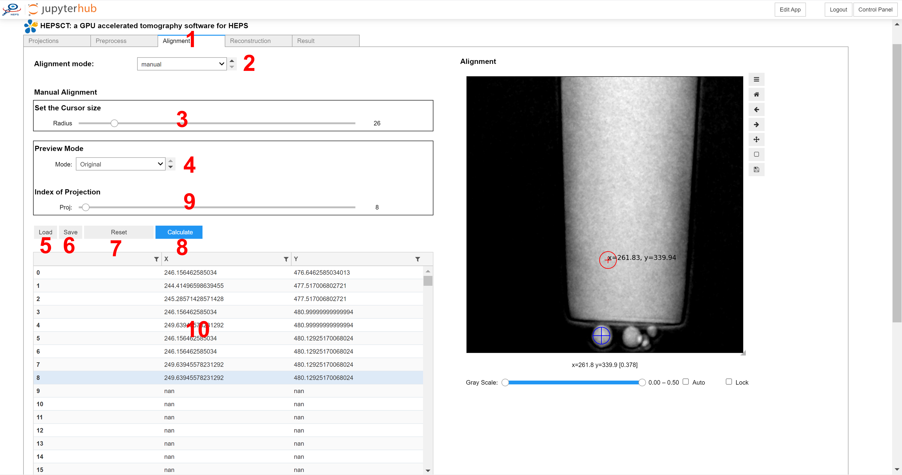

在下拉框选择 manual 模式 (编号2)；
1) 拖动 Radius 拖动条（编号3）调节鼠标大小至标记物大小；将鼠标移动至标记物（如图9所示）双击，每双击一次，图像会自动向下一个角度移动，在每一张投影上重复点击同一特征点，直至完成所有图像，表格（编号10）会记录标记物的位置；
2) 点击 Calculate 按钮（编号 8），程序自动计算偏移量；
3) 点击下拉菜单选择 Shifted 模式；
4) 点击Auto Play按钮（编号4），可以看到标记物被移动到视场中心，且标记物在播放过程中基本不动，则 Align 完成。
5) 点击 Save 按钮（编号6），保存图像的Shift参数；
6) 若已有 shift 的参数文件，可以直接点击Load 按钮（编号5），直接导入shift。

### 自动校正

自动校正主要包含两种校正模式，标记物识别（有金颗粒标记的情况）和 Marker-Free 模式（图像样品衬度高的情况）。

#### 标记物识别

标记物识别的自动校正流程：选区、参数设定以及校正。具体操作如下：

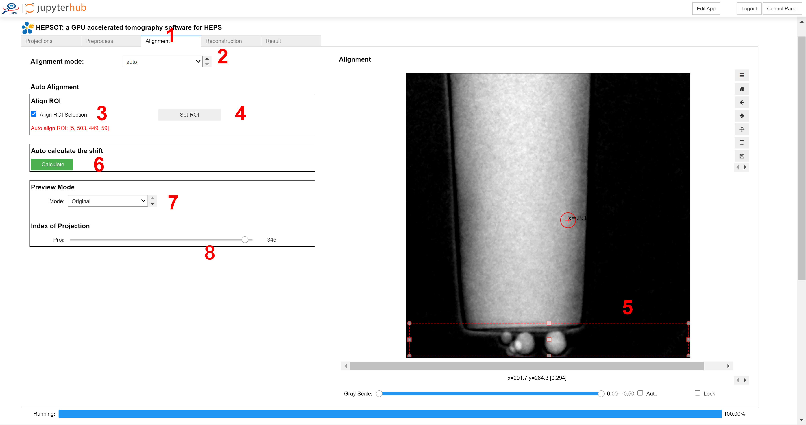

1) 在下拉框（编号2）点击Auto， 切换至自动校正页面，如图所示。
3) 点击选区图标；
4) 摁住鼠标左键并拖动，画出一个红框；
5) 拖动滑动条，观察金颗粒是否始终在红框内，若金颗粒超出红框范围，则调整红框大小使得所有投影中的金颗粒都在红色方框内；
6) 点击Set ROI按钮（编号4）选区完成。

（注：由于选区的大小决定了后续计算的占用内存，因此需要选区还需考虑计算机本身性能。若超过内存，则后续无法计算。）

7) 校正：点击Calculate，程序自动计算偏移量。

## 重建

完成Shift 计算之后，点击Reconstruction Tab进入重建页面（如下图所示）。

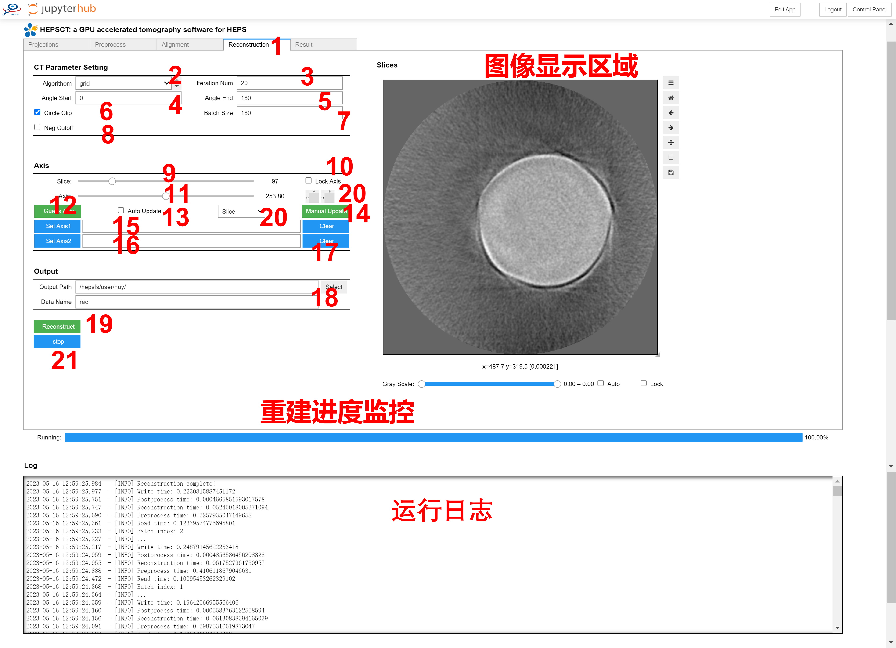

1) 重建算法选择（编号2）：FBP、grid（速度快）、EM等多种算法（默认grid）；
2) 迭代次数（编号3），默认20；
3) 每次重建的切片张数（编号7），与计算机性能（内存）相关，默认180（可根据计算机的性能适当减小或增大）；
4) 起始角度（编号4）：根据实际数据采集输入，默认0；
5) 终止角度（编号5）：根据实际数据采集输入，默认180；
6) 对重建区域进行mask（编号6），在mask圆外的值都为0，可按照实际情况选择是否勾选；
7) 对重建后的图像中的负值进行去除（编号8），可按照实际情况选择是否勾选；
8) 拖动 Slice 滑动条可以改变当前重建切片的层数；
9) 点击 Guess Axis按钮（编号12）可以通过算法计算转轴的值；
10) 若9）中计算的转轴值不准确，可拖动 Axis 滑动条改变重建的转轴，寻找精确的重建转轴的值；
11) “+/-”按钮（编号20）是Axis滑动条的精细调节，每点一次转轴数值变化0.5；
12) 手动预览重建切片结果，每次改变参数后，预览均需点击 Manual Update 按钮（编号14）；
13) 若勾选(编号13)，自动预览重建切片结果，则每次参数改变均自动重建并显示结果；
若样品较大，上层和下层转轴数值差异较大，分别确定上层和下层的转轴值，然后中间通过算法插值，得到转轴值。具体操作见（14，15）
14) 可向左拖动Slice滑动条（编号9），选择上层的Slice，重复12）至14）步骤，找到最合适的转轴，点击set Axis1;（经过此步骤可确定上层的转轴）
15) 与17）操作类似，向右拖动Slice滑动条（编号11），选择下层的 Slice，重复9）至11）步骤，找到最合适的转轴，点击set Axis2;（经过此步骤可确定下层的转轴）
16) 点击 Select 按钮（编号18），选择重建结果保存路径；
17) 点击 Reconstruction按钮(编号19)开始扫描；
18) 若需要中途停止采集点击 Stop 按钮(编号21)。

## 重建结果查看

点击Result Tab进入重建页面（如下图所示）。

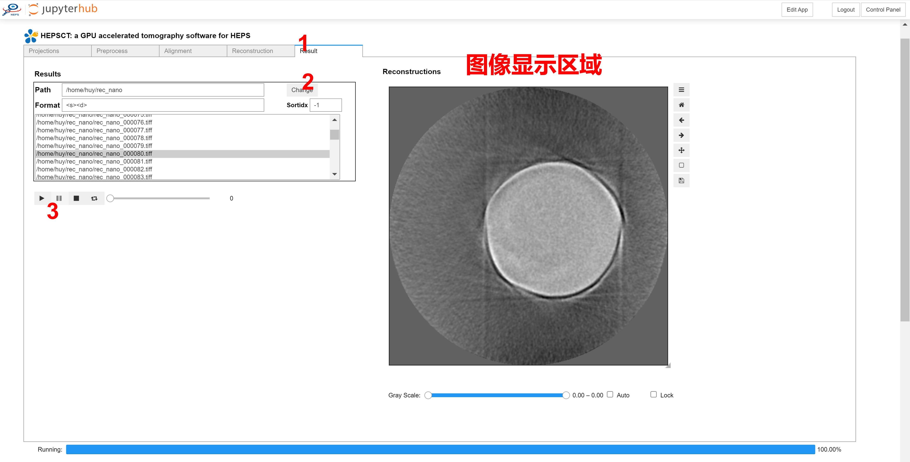

1) 点击 (编号2) Select 按钮导入重建断层数据；
2) 点击下方列表查看重建结果
3) 也可以点击(编号3) Play 按钮，自动播放重建结果
